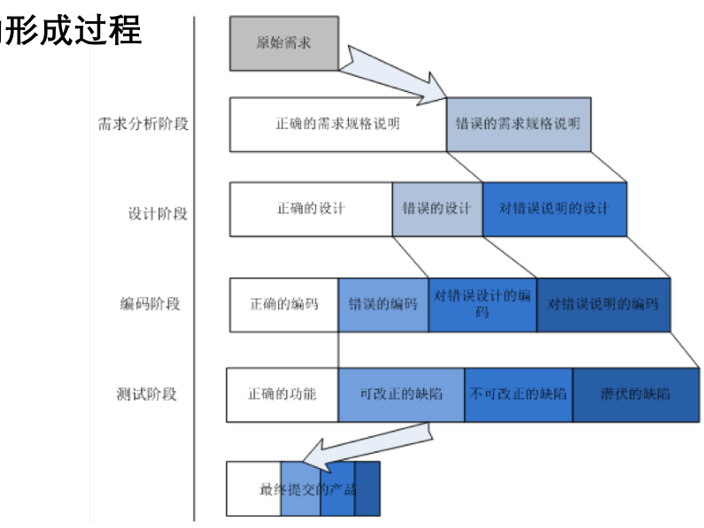
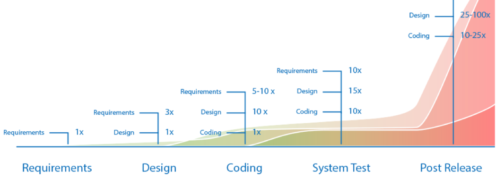

# 走进软件测试

>   Testing can only prove the presence of bugs, not 
>   their absence. -- Edsger W. Dijkstra

**本小节主要介绍软件测试的重要性和困难所在。**

## 互动例子

> 通过一个简单的互动例子带你走进软件测试。

### 题目

找一位身边或网络上的朋友，让他写一段程序。
-   可以用自然语言描述，也可以采用你们都熟悉的某种编程语言
-   这个程序应该满足以下要求：
    1.  输入3个正整数x, y, z，代表一个三角形的三边。
    2.  程序应当判断这个三角形的类型：是等腰三角形，等边三角形，还是普通三角形？

写好之后，共同为这段程序找bug。

**在完成之前，请不要查看以下内容。**

### 答案

以下是一些提示：

1.  能否有效识别*正确*的输入？
    1.  能否有效识别不规则三角形？
    2.  能否有效识别等边三角形？
    3.  能否有效识别不同情况下的等边三角形？
2.  能否有效识别*正确但输入数值特殊*的输入？
    1.  如果用的是C语言等强类型语言，怎么处理用户输入的非常大的数字？（大于任何一种内置类型可存储的范围）
    2.  如果用户输入的数值不是整数，如何处理？（如浮点数）
3.  能否有效处理*不正确*的输入？
    1.  如果用户输入的不是数值？
    2.  如果某个输入为0/负数？
    3.  如果三边不能构成三角形？

### 小结

这是一个非常简单的程序，但未必能保证程序的**功能性指标**符合要求。软件测试的主要目的是保证软件质量，而软件质量可以分为很多不同的方面，包括但不仅限于：
1.  功能性
2.  效率
3.  兼容性
4.  易用性
5.  可维护性
......

相信你已经能感受到，想要保证软件质量，并不是一件非常简单的事情。具体地说，只有穷尽测试（Exhaustive Testing）能够保证上述的程序是完全正确的。而对于一个输入3个int类型为参数的三角形判断函数，如果每个整数都使用 32 bit 表示，三个输入变量约有 $10^{28}$ 种输入组合。而宇宙中恒星的数量约为 $10^{24}$ 。通常来说没有足够的时间来进行穷尽测试。<u>因此软件测试无法完全保证程序的正确性。</u>

## 关于软件缺陷

-   软件缺陷**普遍存在**，且**影响广泛**。
-   软件缺陷的形成过程可以用图直观地表达，早期引入的错误将会影响整个软件生命周期。

-   在软件生命周期的全过程中，**软件缺陷的代价**是不一样的：软件在从需求、设计、编码、测试一直到交付用户公开使用后的过程中，都有可能产生和发现缺陷。**随着整个开发过程的时间推移，更正缺陷或修复问题的费用呈几何级数增长。**

