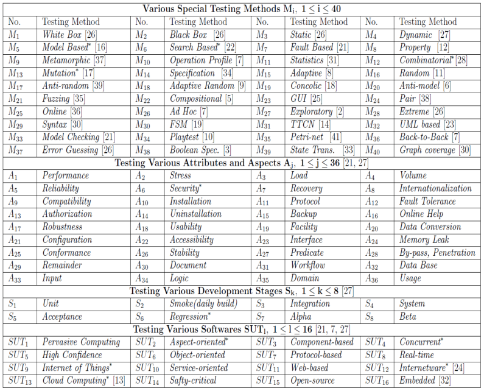
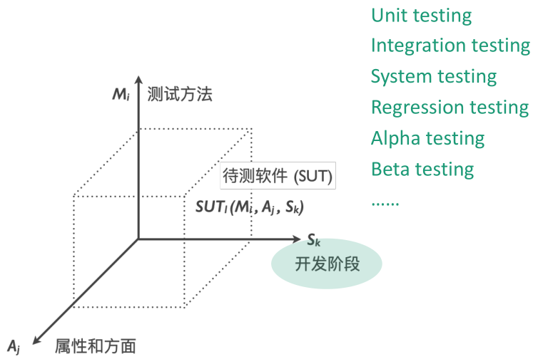
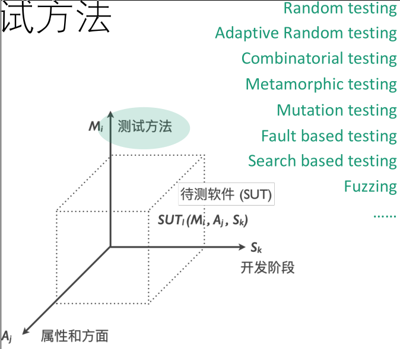

# 走进软件测试

>   Testing can only prove the presence of bugs, not 
>   their absence. -- Edsger W. Dijkstra

## 互动例子

> 通过一个简单的互动例子带你走进软件测试。

### 题目

找一位身边或网络上的朋友，让他写一段程序。
-   可以用自然语言描述，也可以采用你们都熟悉的某种编程语言
-   这个程序应该满足以下要求：
    1.  输入3个正整数x, y, z，代表一个三角形的三边。
    2.  程序应当判断这个三角形的类型：是等腰三角形，等边三角形，还是普通三角形？

写好之后，共同为这段程序找bug。

**在完成之前，请不要查看以下内容。**

### 答案

以下是一些提示：
1.  能否有效识别*正确*的输入？
    1.  能否有效识别不规则三角形？
    2.  能否有效识别等边三角形？
    3.  能否有效识别不同情况下的等边三角形？
2.  能否有效识别*正确但输入数值特殊*的输入？
    1.  如果用的是C语言等强类型语言，怎么处理用户输入的非常大的数字？（大于任何一种内置类型可存储的范围）
    2.  如果用户输入的数值不是整数，如何处理？（如浮点数）
3.  能否有效处理*不正确*的输入？
    1.  如果用户输入的不是数值？
    2.  如果某个输入为0/负数？
    3.  如果三边不能构成三角形？

### 小结

这是一个非常简单的程序，但未必能保证程序的**功能性指标**符合要求。软件测试的主要目的是保证软件质量，而软件质量可以分为很多不同的方面，包括但不仅限于：
1.  功能性
2.  效率
3.  兼容性
4.  易用性
5.  可维护性
......

相信你已经能感受到，想要保证软件质量，并不是一件非常简单的事情。具体地说，只有穷尽测试（Exhaustive Testing）能够保证上述的程序是完全正确的。而对于一个输入3个int类型为参数的三角形判断函数，如果每个整数都使用 32 bit 表示，三个输入变量约有$10^{28}$种输入组合。而宇宙中恒星的数量约为$10^{24}$。通常来说没有足够的时间来进行穷尽测试。<u>因此软件测试无法完全保证程序的正确性。</u>

## 关于软件缺陷

-   软件缺陷**普遍存在**，且**影响广泛**。
-   软件缺陷的形成过程可以用图直观地表达，早期引入的错误将会影响整个软件生命周期。

-   在软件生命周期的全过程中，**软件缺陷的代价**是不一样的：软件在从需求、设计、编码、测试一直到交付用户公开使用后的过程中，都有可能产生和发现缺陷。**随着整个开发过程的时间推移，更正缺陷或修复问题的费用呈几何级数增长。**

## 软件测试的基本概念

在软件测试领域，通常会细分三个词：

1.  Fault: an anomaly in the source code of a program that 
    may lead to an error
2.  Error: the runtime effect of executing a fault, which may result in a failure
3.  Failure: the manifestation of an error external to the program

下图能够帮助理解这三个概念间的关系。

**还是太过抽象？没关系，我们来看一个实际的例子。**

下图这一小段代码隐藏有bug吗？

圈中的地方就是Fault，它是错误的起源。

在选择了合适的测试用例的情况下，我们能在运行时获得Error，并且观察到Failure。

**注意：当选用的测试用例不合适时，尽管程序中有Fault，但我们不一定能观察到Failue。**

## 软件测试的目的

## 软件测试与开发的关系

常见的软件测试的过程模型有V模型，W模型，H模型和X模型等，一句话概括就是，测试活动应当与开发活动同时进行。对应的有两个经典概念：TDD和CI/CD。

## 这门课能带给你什么？

### 对于软件测试的系统性总览视角

现在应用较多的软件测试方法多达数十种。

按照测试方法主要关注的软件性质侧面，除了常见的黑盒测试白盒测试分类外，可以这样理解：

这些方法将在下文中详细介绍。如果此时不太理解这些分类方法，你可以在阅读完第四章后重新回来阅读。

### 生活中的应用

-   Testing exists everywhere
    -   manufacturing
    -   agriculture
    -   shopping
    -   education
    -   …
-   Everyone is a tester
    -   make friends
    -   buy something
    -   work
    -   …

