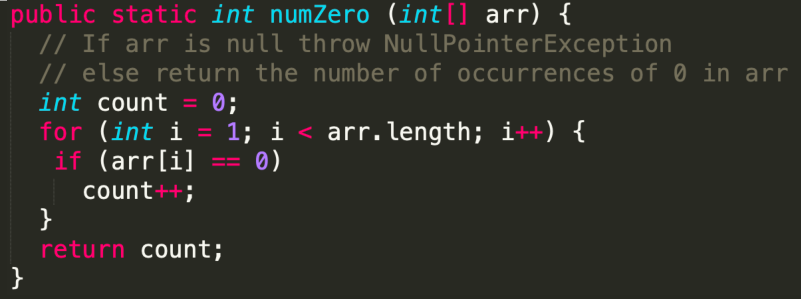
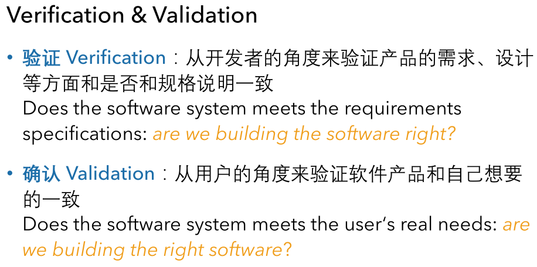

# 软件测试的基本概念

**本小节介绍一些软件测试领域内的常识性知识。**

## Fault-Error-Failure  

在软件测试领域，通常会细分三个词：

1.  Fault: an anomaly in the source code of a program that 
    may lead to an error
2.  Error: the runtime effect of executing a fault, which may result in a failure
3.  Failure: the manifestation of an error external to the program

下图能够帮助理解这三个概念间的关系。

**还是太过抽象？没关系，我们来看一个实际的例子。**

下图这一小段代码隐藏有bug吗？

圈中的地方就是Fault，它是错误的起源。

在选择了合适的测试用例的情况下，我们能在运行时获得Error，并且观察到Failure。

**注意：当选用的测试用例不合适时，尽管程序中有Fault，但我们不一定能观察到Failue。**

## 软件测试的目的

## 软件测试与开发的关系

常见的软件测试的过程模型有V模型，W模型，H模型和X模型等，一句话概括就是，测试活动应当与开发活动同时进行。对应的有两个经典概念：TDD和CI/CD。

