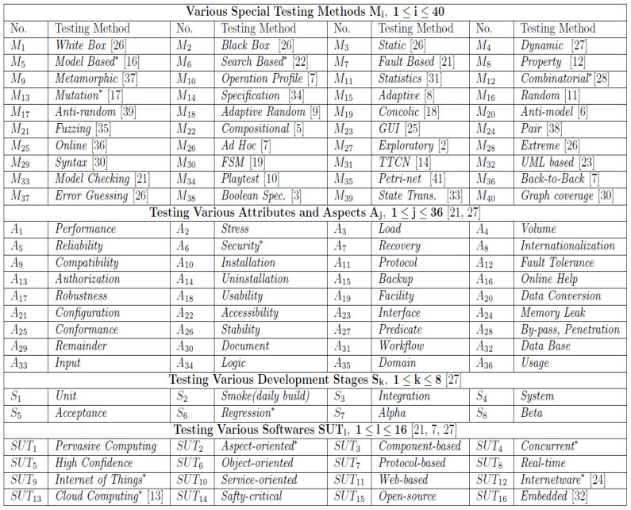
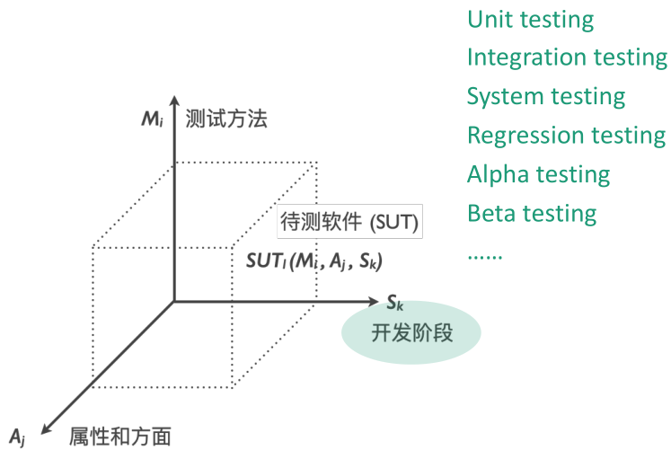
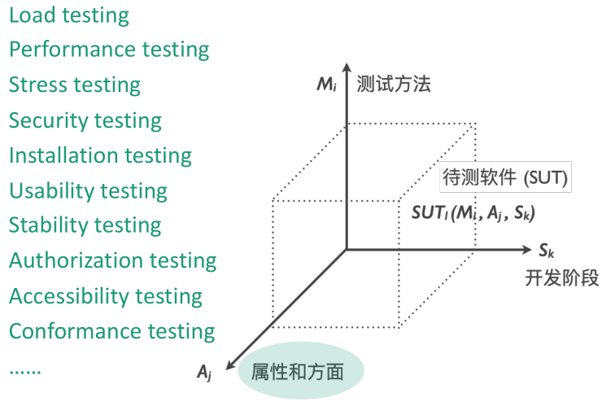
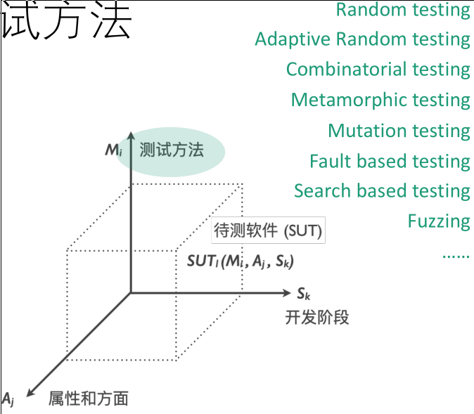
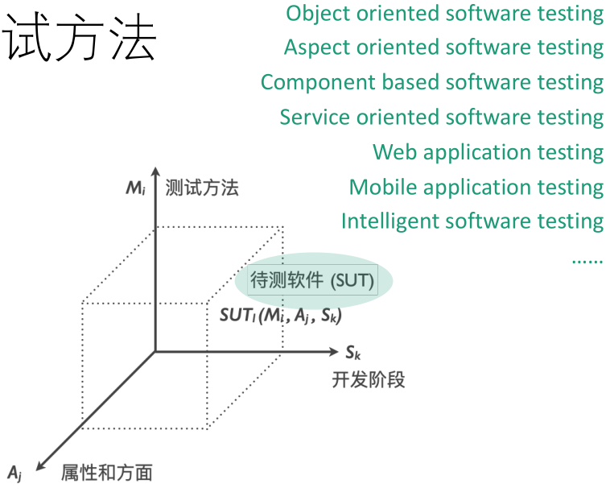

# 你将收获到的东西

## 对于软件测试的系统性总览视角

现在应用较多的软件测试方法多达数十种。

按照测试方法主要关注的软件性质侧面，除了常见的黑盒测试白盒测试分类外，可以这样理解：

这些方法将在下文中详细介绍。如果此时不太理解这些分类方法，你可以在阅读完第四章后重新回来阅读。

## 已经实际应用的特殊测试方法

这是课程后半部分的内容，想看的小伙伴可以提issue或者发邮件给我催更。（联系方式在README里有写哦）

## 测试思想在生活中的应用

* Testing exists everywhere
  * manufacturing
  * agriculture
  * shopping
  * education
  * …
* Everyone is a tester
  * make friends
  * buy something
  * work
  * …

