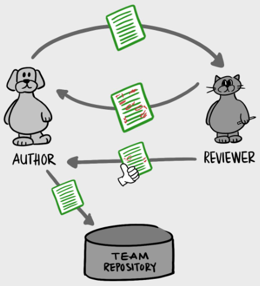

# 白盒静态-代码审查

> A code review is a process where someone other than the authors of a piece of code examines that code.

## 过程

一个简单的代码审查过程如下：

1. 代码作者提交初始代码给审核者
2. 审核者审核后将comments和代码交还给代码作者
3. 不断反复上述过程，直到审核者同意将代码提交到团队的代码库
4. 作者将最终代码提交到团队代码库

## 目的

* Find faults
* Ensure code meets standards, and understandable \(improve quality, as the code will be reviewed by others\)
* Share knowledge
  * 促进新老员工之间，或者同级但领域不同的员工之间的交流
* Collaborate on design and problem-solving

## 地点与方式

* Showing code to a colleague at a computer \(pairing, remote\)
* Mob reviewing in a conference room
* Code review software
* Checking out a commit or branch

## 我们对Code Review期待什么？

* Design: Is the code well-designed and appropriate for your system?
* unctionality: Does the code behave as the author likely intended? Is the way the code behaves good for its users?
* Complexity: Could the code be made simpler? Would another developer be able to easily understand and use this code when they come across it in the future? \(avoid over-engineering\)
* Tests: Does the code have correct and well-designed 
* Naming: Did the developer choose clear names for variables, classes, methods, etc.?
* Comments: Are the comments clear and useful?
* Style: Does the code follow the style guides?
* Documentation: Did the developer also update relevant 

## 代码审查的一些原则

* The purpose is not to reject the code \(the goal is to accept and ship the code\).
* Technical facts and data overrule opinions and personal preferences.
* Follow specific guidelines.
* Be constructive and specific.
* Review and respond in a timely fashion. 
* [Code Review Developer Guide @ Google](https://google.github.io/eng-practices/review/)
* [Code Review Guidelines @ GitLab](https://docs.gitlab.com/ee/development/code_review.html)

