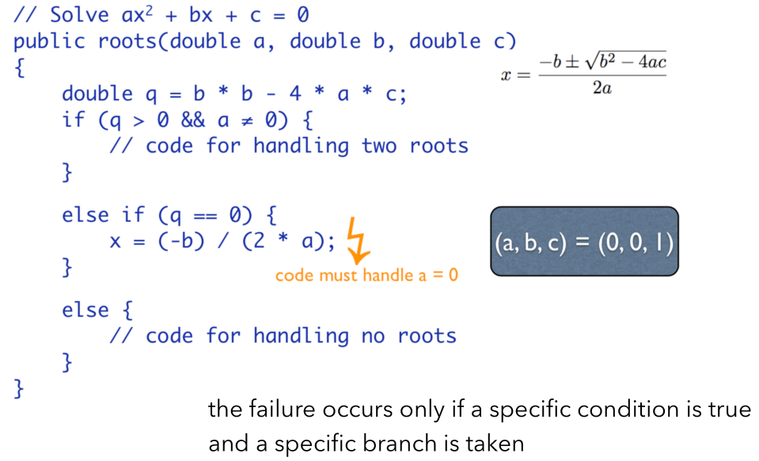
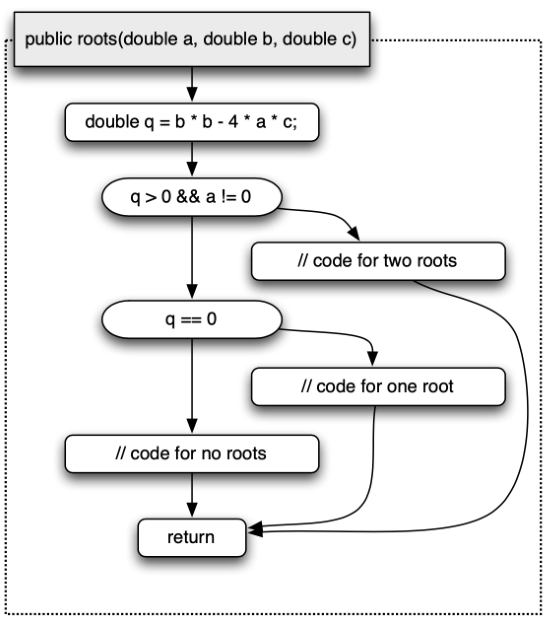
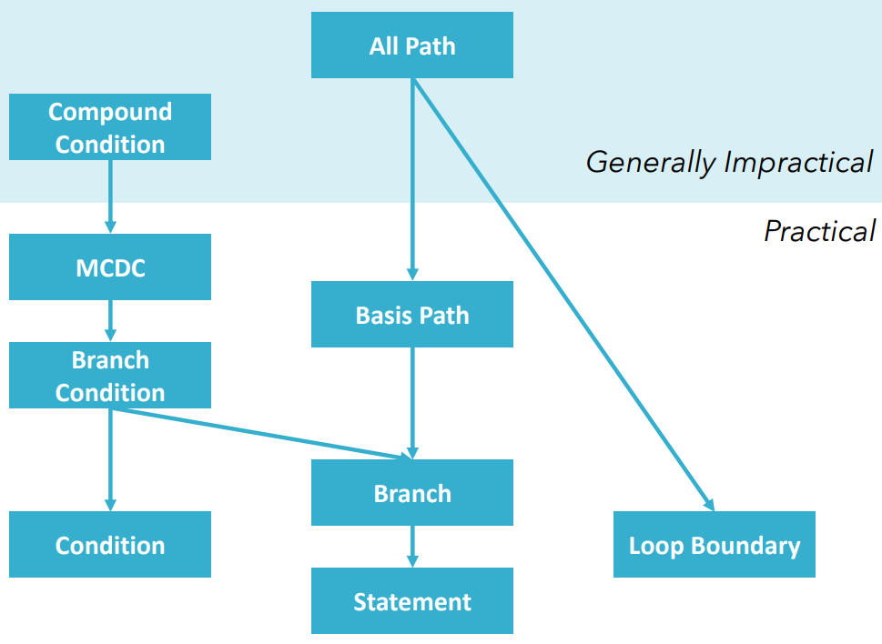

# 白盒动态-结构覆盖

## 定义

白盒测试是对软件的过程性描述做细致的检查，它利用程序内部的逻辑结构及有关信息设计测试用例，对程序的逻辑路径进行测试白盒测试也称为结构测试（Structural Testing）。

对于测试来说，一个非常重要的问题是：`测试应该在什么时候停止 / 需要设计多少测试用例？`

* 一个完美但不现实的方案：执行所有可能的测试用例/找到所有软件故障
* 为了尽可能提高测试的故障检测能力。 我们需要依赖一定的标准（surrogate metrics），因为我们无法在测试前直接度量测试用例的故障检测能力。
* 在给定标准下，我们能评价不同测试用例的优劣，并确定对应的测试停止准则。
* 在测试时我们能度量什么？

为此，我们引入代码结构覆盖（Structural Coverage）的概念。

## 如何评价覆盖程度

### 控制流图-CFG

为了便于描述结构覆盖的概念，我们需要先了解控制流图的概念。 以第一章中判断三角形的程序为例

它的控制流图可以是这样的：

详细地来说，控制流图的相关概念如下：

* A control flow graph expresses paths of program execution 
* Nodes are basic blocks \(sequences of statements\), and edges represent control flow – the program execution proceeds from the end of one basic block to the beginning of another
* The more parts are covered \(executed\), the higher the chance of a test to uncover a defect
* The CFG can serve as an adequacy criterion for test cases

### 具体的覆盖程度评价

有众多的评价覆盖程度的方式：

1. 语句覆盖（Statement）：每个语句都至少执行一次
2. 分支覆盖（Branch）：每个判定的真分支和假分支至少 执行一次
3. 条件覆盖（Condition）：判定语句中每个条件的真假都 至少执行一次
4. 分支条件覆盖（Branch Condition）：每个判定的真分支和假 分支、以及每个条件的真假都至少执行一次
5. 条件组合覆盖（Compound Condition）：每个判定的所有可能的条件取值组合都至少执行一次
6. **修改决策条件覆盖（MCDC）**：每个**条件变量独立影响**判定的真假
   1. 基本方法（假设有n个条件）
      1. 最少需要n+1个测试用例：1个Base Case和n个Change One Condition Case，这里的Base Case是相对的，如1号用例改变条件生成了2号用例，而3号用例无法用1号用例修改得到，这时可能可以利用2号用例作为3号用例的Base Case进行修改（这一方法需要设计者认真设计）。
      2. 最多需要2n个测试用例：n个Base Case和n个Change One Condition Case（这一方法写出来的速度很快，不需要很认真地思考设计）。
7. 路径覆盖（All Paths）：覆盖代码中所有可能的路径
8. 循环覆盖（Loop Boundary）：每个循环执行特定的次数（0，1，Max-1，Max-2，…）
9. **基本路径覆盖（Basis Paths）**：覆盖代码中的**独立路径**
   1. 独立路径的定义：
      1. 独立路径是指_包含了_任何_其他独立路径未包含的新节点或边_的路径
      2. 上界是控制流图（Control Flow Graph）的**环复杂度**
         1. 环复杂度的计算方式：
            1. V\(G\) = \#Edges – \#Nodes + 2 x \#Parts\(\# of unconnected parts of the graph\)
            2. V\(G\) = \# Predicates\(分支点的数目\) + 1
            3. V\(G\) = \# Regions in the graph\(用一个圈把控制流图圈起来，数共有几个封闭区域\)

## 不要迷信覆盖程度

用一张图比较各覆盖定义的强度：

不要迷信覆盖率：

* 希望覆盖所有代码段是非常困难的。
  * 出于防御性编程的角度，有的代码段就是设计来不被执行的
  * 有的分支条件可能会由于相关的不会被满足
* 覆盖了的代码并不代表没有错误。

