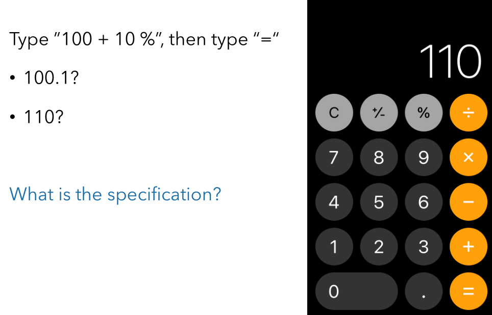

# 黑盒测试/功能测试

> 黑盒测试（Black-box Testing）是指在完全不考虑程 序的内部结构和处理过程的前提下，只基于规格说明 来设计测试用例。 黑盒测试又称为功能测试（Functional Testing）。

接下来分四个小部分介绍：
-   等价类划分（Equivalence Class Partition）
-   边界值分析（Boundary Value Analysis）
-   因果图和决策表（Cause Effect Graph & Decision Table）
-   语法测试（Syntax Testing）

# 等价类划分

>   将所有可能的输入数据划分成若干等价类，从每个等价类中选择一组代表性数据用于测试。（认为程序在每个等价类的输入数据上都表现相同的行为）。

1. 需要划分两种等价类
    1. **合理**等价类：满足数据输入规范的有意义输入（检测程 序模块是否实现了设计规格规定的功能和性能）
    2. **不合理**等价类：不满足数据输入规范的无意义输入（检测程序模块是否能够拒绝无效数据输入）
2. 划分标准的经验法则
    1. 如果输入条件规定了取值范围、或值的个数**（区间）**，则可以确定**一个有效**等价类和**两个无效**等价类
    2. 如果规定了数据的一组值**（枚举）**，而且程序要对每个输入值分别进行处理，这时可为每一个输入值确定**一个有效**等价类， 并确定**一个**不属于上述值的**无效**等价类
    3. 如果规定了输入数据必须遵守的规则**（如密码必须以字母开头，有几位等）**，则可以确立一个有效等价类（符合规则）和若干个无效等价类（从不同角度 违反规则）
    4. 根据程序功能或软件行为来确定，通常需要借助领域和语义信息。如百分制到等级制转换。
3. 执行步骤
    1. 划分
    2. 设计一个测试用例，使之**尽可能覆盖尚未被覆盖的多个有效等价类**。重复至所有合理等价类被覆盖
    3. 设计一个测试用例，使之**仅覆盖一个尚未被覆盖的不合理等价类**。重复至所有不合理等价类被覆盖

# 边界值分析

>   针对各种边界情况设计测试用例。

1. 确定边界值的经验法则
    1. 第一个 / 最后一个，最大 / 最小，超过 / 在内，不多于 / 不少于，相邻 / 最远
    2. 如果输入条件规定了值的范围**（连续区间）**，则可以选取**刚达到这个范围**的边界值，以及**刚超越这个范围**的边界值作为测试输入数据
    3. 如果输入条件规定了值的个数**（离散区间）**，则可以选取**最大**个数、最小个数、比最大个数**多 1**，比最小个数**少 1** 的数作为测试数据
2. 执行步骤
    1. 最重要的是确定影响输出结果的**参数**（显式输入的参数）和**环境对象**（如有文件交互的程序中，文件的具体内容）

# 因果图和决策表(Decision Table)

等价划分法和边界值分析法都只**孤立地考虑各个输入数据**，而**没有考虑多个输入数据间的组合效应**，可能会遗漏了输入数据易于出错的组合情况。

>   -   因果图是将规格说明转换为一个布尔逻辑网络的一种工具。
>   -   决策表是刻画系统业复杂务实现逻辑的一种工具。

*这一部分上课没有讲得很细致，不过ISO的Testing标准中有提到相关的测试方法，感兴趣的同学可以去看看论文。*

# 语法测试

Why-observation：用户的输入可能是任意的，而：

-   Good user interface designers design their systems so that it just doesn’t accept “garbage” inputs
-   Good testers subject systems to the most creative “garbage” possible

How-testing the syntax

-   Test the “normal” conditions by covering the BNF syntax graph of the input language
-   Test the “garbage” conditions by testing the system against invalid data

Example

在iOS系统上计算的结果是110，表示的语义是“消费100元，外加10%的小费，总共需要支付多少钱”。