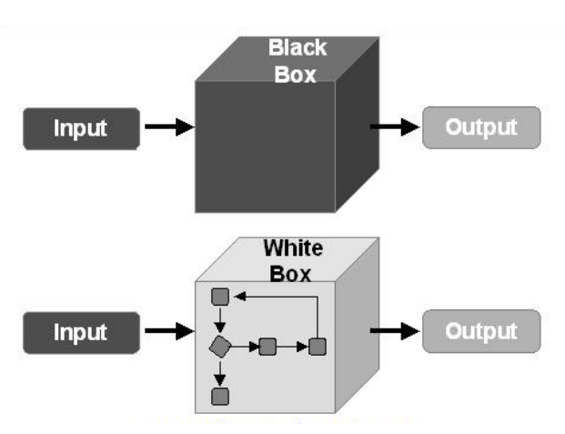

# 第二章-基础\(1\)黑盒白盒测试

按照软件测试用例的设计方法，我们可以从两个细分维度进行分类——静态或是动态，白盒或是黑盒。首先是几种测试方法的定义：

* Dynamic analysis: **execute the program** to see if it behaves correctly
* Static analysis: check the correctness **without executing the program**
* White box testing
  * Test based on **code**
  * 看代码本身
  * Test covers as much **implemented** behaviors as possible
* Black box testing
  * Test based on **specification**
  * 不看代码，看产品规格说明书
  * Test covers as much **specified** behaviors as possible

接下来，我们通过一个表格和四个小节详细介绍表格中的四个软件测试方法。

| 测试种类 | 静态 | 动态 |
| :---: | :---: | :---: |
| 白盒测试 | 代码审查 | 结构覆盖 |
| 黑盒测试 | 文档审查 | 功能覆盖 |

