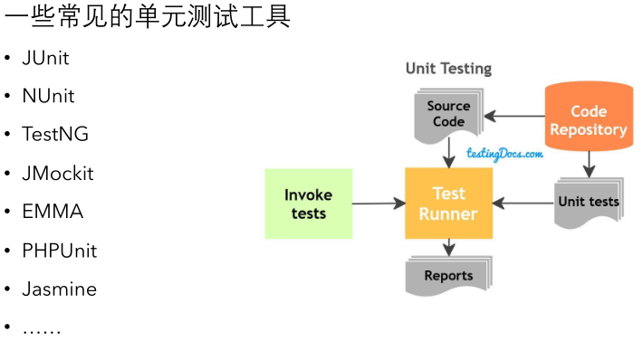
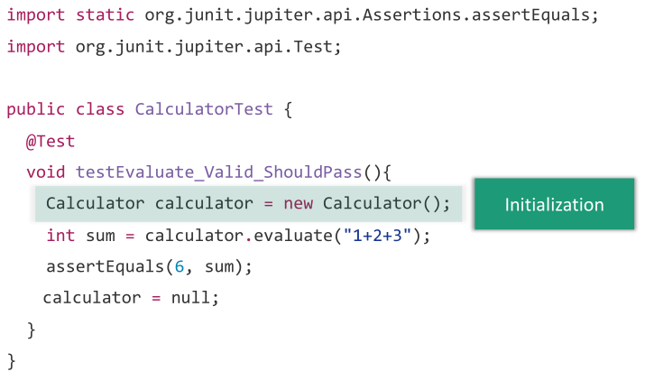
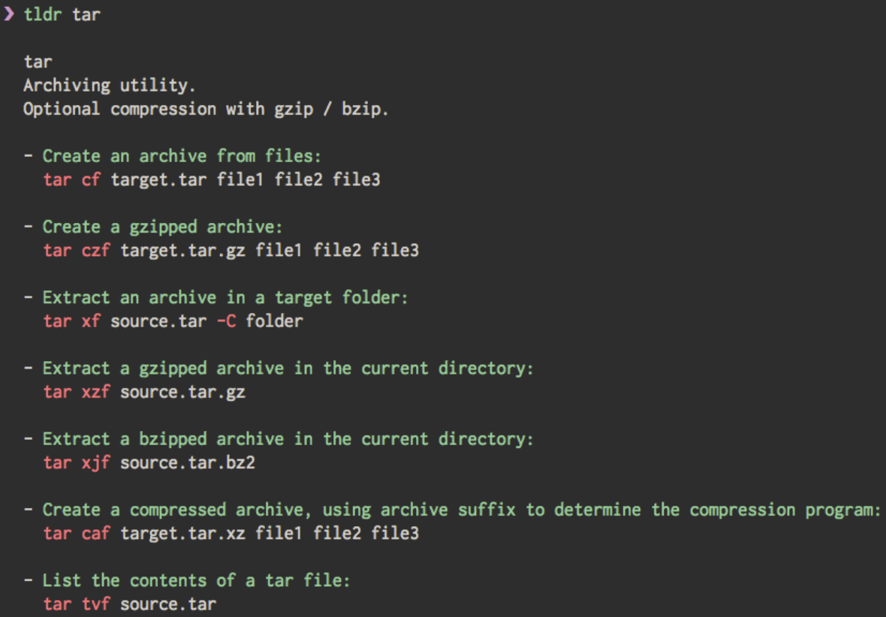
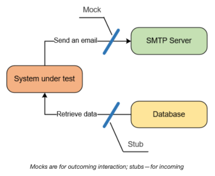
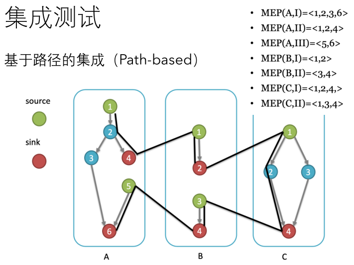
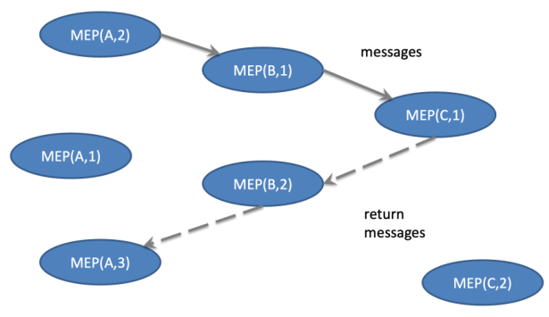
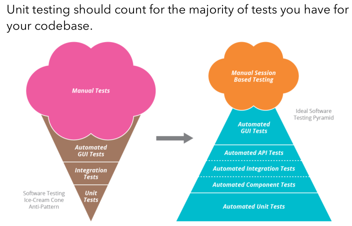

# 单元-集成-系统测试

## 单元-集成-系统测试

## 单元测试

### 单元测试有多重要？

> 1.01的365次方是37.8
>
> 0.99的365次方是0.03

单元质量能够决定系统的质量，一个系统由众多的单元构成。当每个单元的可靠性都足够高，系统的可靠性才足够高。

#### 单元测试的思想

> 单元测试通过编写一小段代码来检测被检测代码中一个较小而明确的功能是否正确。其背后的思想是分而治之以降低难度。

这些小而明确的功能可能是：

* 模块接口（参数及其属性是否正确和一致、输入输出错误是否检查并处理 ）
* 局部数据结构（错误的类型或初始值、类型不匹配、溢出）
* 边界条件
* 独立路径
* 错误处理路径

#### 准则

* （单元测试）通常**由最熟悉代码的人编写执行**（如程序作者）
* 应该**在最低的功能/参数**上验证程序正确性
* 应该产生**可复现、一致**的结果
* **执行速度**快（并行化）
* 测试后，**机器状态**保持不变
* 应该具有一定的**独立性**，其执行和结果不应该依赖于别的测试（Flaky Test则深入挖掘测试用例间的依赖关系）
* 保证一定的**代码覆盖率**
* 需要和产品代码一起**维护**

#### 单元测试需要自动化

* **测试用例设计**需要一定的创造力，但**测试执行**不是：人工执行测试往往低效而易错。
* 测试自动化（框架）通常关注How（如何执行测试）和When（在什么时候执行测试）
  * 测试执行环境和前置**条件**的自动设置
  * **自动执行**测试用例
  * **自动比对**输出结果

#### 特点

* （单元测试是）_一种验证行为_，**能够为后续的开发提供支援，为代码的重构提供保障。**
* _一种设计行为_，使我们从调用者的角度观察和思考（Test Driven Development-测试驱动开发）
* _一种编写文档行为_，是展示功能的最佳文档（Linux工具tldr与man的对比）
* _回归性_，可以随时随地的快速运行测试（Automation）（例如，在上jyy的课程时，老师提到能够通过inotify和其他脚本实现**改动源代码时自动编译运行**。如果你也想试试，可以参考[这个网站](https://dave.cheney.net/2016/06/21/automatically-run-your-packages-tests-with-inotifywait)）

### 实践中单元测试怎么操作？

#### 常用工具

这类工具能帮助我们：

* 自动化地执行测试
* 自动化地返回结果
* 部分工具能够提示测试用例集的覆盖率

#### 测试用例的编写

* 测试输入数据 Test Input
* 测试预期输出 Test Oracle
* 测试初始化 Initialization \(tasks before test execution\)
* 测试步骤 Test Steps \(e.g., method calls and output comparison\)
* 测试环境还原 Tear Down \(tasks after test execution\)

**用JUnit举个例子**：

* 命名惯例：`class name + Test`
* 写上`@Test`告诉JUnit接下来是一个测试方法 
  * 这是Java语言进行高级扩展的机制，也叫元（meta）扩展机制
  * JUnit会按照独立程序的方式处理标识后的方法，不需要用户自己写一个main函数
* Initialization：如图所示
* Test Step
  * Test Input-`"1+2+3"`在本例中，仍需要由测试者手动填写
  * Test Oracle-`"assertEquals(6, sum);"`
* Tear down-`calculator  = null;`（Java不需要delete-语言设计时的内存管理机制）

### 关于单元测试，再多说五块钱的？

* 分而治之的基本思想
  * 各种经典的算法都采用分而治之的思想，
  * 近年兴起的分布式计算与边缘计算等研究应用领域，也是这一思想的应用
* Flaky Test
  * Flaky Test主要关注这一问题：在有的测试实践中，当输入的测试用例顺序不同时，有时程序能通过测试，有时则不能通过。
  * 如果你感兴趣，可以查看[这里](https://docs.gitlab.com/ee/development/testing_guide/flaky_tests.html)。
* Test Driven Development
  * 直观地说，你可以先写测试用例，然后针对测试用例编程。这种开发方式的优点在于开发人员能够控制并掌握开发的进度。
  * 如果你感兴趣，可以查看[这里](https://en.wikipedia.org/wiki/Test-driven_development)。
* Linux工具[tldr](https://tldr.sh/)与man的对比
  * jyy老师倾情推荐，一图流安利：
* Java不需要delete-语言设计时的内存管理机制
  * 语言的内存管理机制是一个非常有趣的话题
  * C/C++给程序编写者自由地动态分配内存的权力，他们也自动地需要承担管理内存的责任。不谨慎的程序员往往会遇到段错误或内存泄漏。
  * Java通过动态的垃圾回收机制，在运行时自动地回收不可达对象。这带来了动态时的运行开销，同时也并不能保证回收所有的垃圾（不再使用的内存），如循环指向的一组对象
  * 其他语言，如Rust，则通过引入“所有权”机制处理内存管理问题

## 集成测试

> 在单元测试的基础上，采用适当的策略将已通过测试的模块组装成子系统或系统，并确保各模块组合到一起后能按既定的设计要求运行。重点测试模块的接口、兼容性和全局数据结构。通常采用渐增式方法（依次集成新模块）。

### Decomposition-based（基于分解的集成）

1. Big bang-一次把所有小模块都放到一起测试
   1. 优点：实现简单粗暴
   2. 特性：难以快速定位出错点
2. Bottom up-自底向上集成，从原子模块开始向上
   1. 优点：利于优先验证某个特定子功能的正确性
   2. 特性：需要一个测试驱动程序（Driver）来协调测试数据的输入输出（设计一个架空的上层）
3. Top down-自顶向下集成，利用DFS或BFS
   1. 优点：利于优先验证主要控制模块或关键抉择（利用DFS时能尽早验证一个完整功能）
   2. 特性：需要使用stub（桩程序）和mock（模拟程序）
      1. stub：模拟的数据提供方。在图一中不做逻辑计算，根据输入直接return期望的返回值
      2. mock：模拟的数据接受方。
   3. 举个例子：
4. Sandwich-混合策略（计算机世界随处可见的Trade-Off）
   1. 对软件结构中上层使用的是自顶向下方法，而对软件结构中下层使用的是自底向上方法。当被测试的软件中关键模块比较多时，实用混合策略是一种较好的折衷选择。

### Path-based（基于路径的集成）

* 设置source（源，起点）和sink（汇，终点）节点，对每个子模块，从任意一个source可以到任意一个sink。把每个路径视为更小的基本模块，对这一基本模块进行测试。

> A Module Execution Path \(MEP\) is a sequence of modules that begins with a source node and ends with a sink node, with no intervening sink nodes.

一个简单的例子：

假设有三个模块ABC，其中各有一组Basic Block。在每组模块中，选定起点和终点，则在A中有三组MEP，它们的起点终点分别是1，6；1，4和5，6。

例如一个测试用例的运行过程可能通过如图所示的这一组路径：

当然我们希望将大部分路径Cover住。

## 系统测试

> **将已通过集成测试的软件系统视为一个整体**，与外部硬件设备、数据、以及人员等其它元素结合在一起， **在使用环境下**对软件系统进行的一系列严格测试。

* 重点测试软件产品的各**功能**是否满足用户的要求
* 测试还包括**性能、安全性、兼容性等**软件特性及方面的测试 

### 测试的金字塔模型（The Testing Pyramid）

图中每一块的大小直观地表达在这一测试活动上分配的资源和实践，云彩样则表示根据不同项目，其变动程度较大。左边的模型也叫冰淇淋模型，右边的模型则称为测试金字塔模型。由于在软件开发后期进行故障修复的成本比前期高很多，右侧的模型所对应的测试比重安排更佳。

