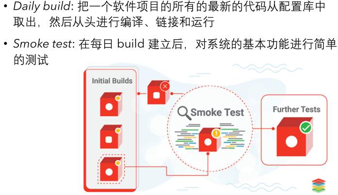
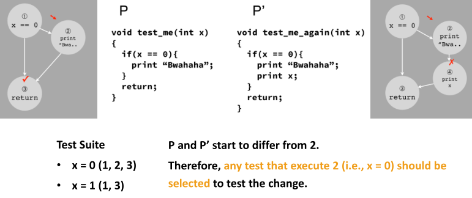
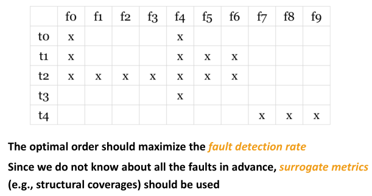
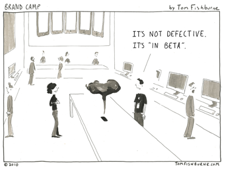

# 冒烟-回归-Alpha-Beta测试

## 冒烟-回归-Alpha-Beta测试

这一小节的四种测试方法同样是根据软件开发的阶段进行分类的，主要会介绍：

1. 冒烟测试
2. 回归测试
3. Alpha测试
4. Beta测试

## 冒烟测试\(Smoke Testing\)

> 对一个硬件或硬件组件做更改或修复后，直接给设备通电。若没有冒烟，则通过测试。

实际的例子：Daily Build and Smoke Test-Microsoft

在每日构建完成后，对系统的基本功能进行简单的测试，是将代码更改提交到代码库之前的验证过程。

* 仅关注系统的最小功能集合。如程序能不能运行？用户接口是否打开？GUI是否响应？文件的打开、写入、关闭是否成功？
* 测试周期短、响应速度快
* 最小化集成风险。如能够尽早发现项目中的不兼容性问题
* 简化故障诊断

_注：随着CI/CD技术的发展，这一测试方法较少被关注。_

## 回归测试

#### 定义与基本特性

> 代码修改后，重新测试以防引入新错误。

* 软件开发的**各个阶段**都会进行**多次回归测试**
* 通常要求**自动化**以降低软件的开发维护成本
* _在当今的**快速迭代开发**中，回归测试进行得\*更加频繁_
* 回归测试会**对已有的测试用例库**进行一些**增删和改进**

### 实践的关键问题

> Critical problem: the regression test suite is too large.

一个关键性的问题是，测试用例集规模通常会随着开发进行而增大，以至于完全测试所有用例开销巨大。解决方案如下：

* 测试用例约减（Minimization）
* 测试用例选择（Selection）
* 测试用例排序（Prioritization）

### 具体的解决方案

#### Minimization（测试用例约减）

1. 启发：测试用例存在**冗余**
2. 思考：保证某种测试覆盖度，从所有测试用例中删去冗余的部分
3. 实现：这可以抽象为set-cover problem（**集合覆盖问题**），但这一问题是NP的。但在测试中，不一定要得到最优解，一个近似最优的解法也是可以接受的，比如用贪心算法的思想，每次选择能覆盖最多元素的测试用例。
4. 进阶：但是如果不同的用例需要的时间不同，问题变成了一个**多目标问题**（测试运行时间最小，覆盖率最高）。可以设置权值解决。

#### Selection（测试用例选择）

1. 启发：测试用例未必与**变化**有关
2. 思考：挑选出部分用例，使得所有与代码变化相关的部分都能被检测到
3. 实现：举个例子。

   在图中，由于新加入的变化使得程序在执行语句2后的执行内容发生了变化，我们**选取所有会执行过程经过语句2及其之后的语句的用例**。

4. 进阶：为了测试的安全性（safety/soundness），仍然可能是代价高昂，没有足够的资源来执行。因此我们需要结合其他两种方式进一步精简测试用例。

#### Prioritization（测试用例排序）

1. 启发：测试用例有不同的**重要程度**
2. 思考：优先执行可能发现故障的用例，从而在测试停止时获得更大的收益
3. 实现：给定一个fault matrix（t为测试用例，f为可能检测到的错误），应用贪心算法。

   

4. 进阶：需要注意的是，我们无法在测试前得到精确的fault matrix，即这个矩阵只有在测试结束之后才能生成。在实践中可以选择statement coverage或cost来评价重要程度。

#### 小结

1. Minimization-redundancy
2. Selection-safety
3. Prioritization-best cost performance

## $\alpha$测试

> 用户在开发环境或模拟实际操作环境下进行的测试。

关注的是产品的基本功能，即：

* 功能
* 性能
* 本地化
* 可用性
* 产品界面和特色

测试人员是除产品开发人员之外首先见到产品的人。从测试阶段上看，可以从产品编码结束之时开始，或在模块测试完成之后开始，也可在测试过程中产品达到一定的稳定和可靠程度以后再开始。市面上有不少的第三方测试机构与服务。

## $\beta$测试

> 用户在实际使用环境下进行的测试。开发者通常不在测试现场，无法控制测试环境。

测试除了关注产品的基本功能外，还着重于产品的**支持性（文档，客户培训和支持产品等）**。从测试阶段上看，通常处于整个测试的最后阶段。

最后图一乐：

