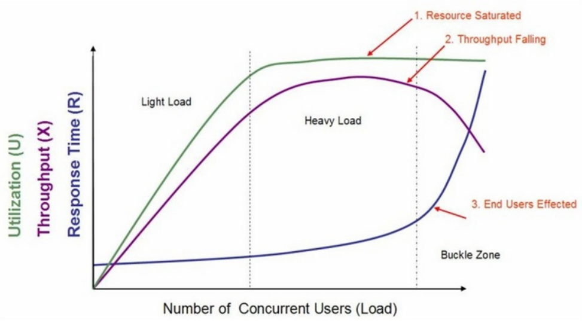
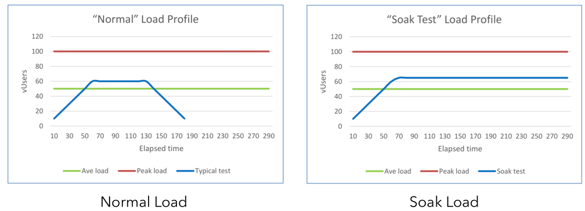
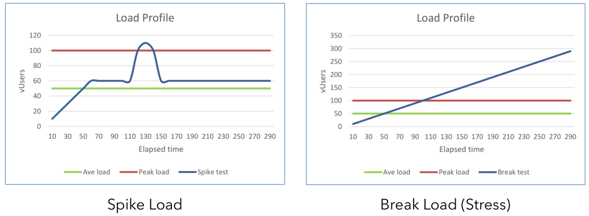
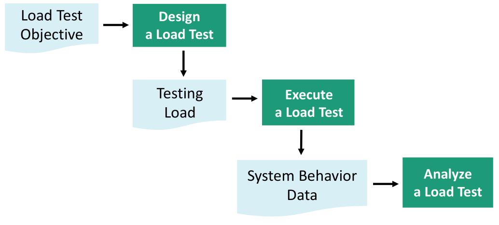
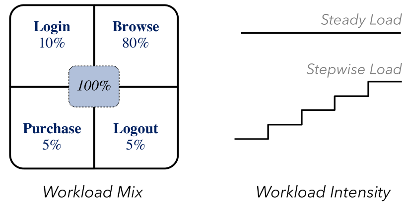
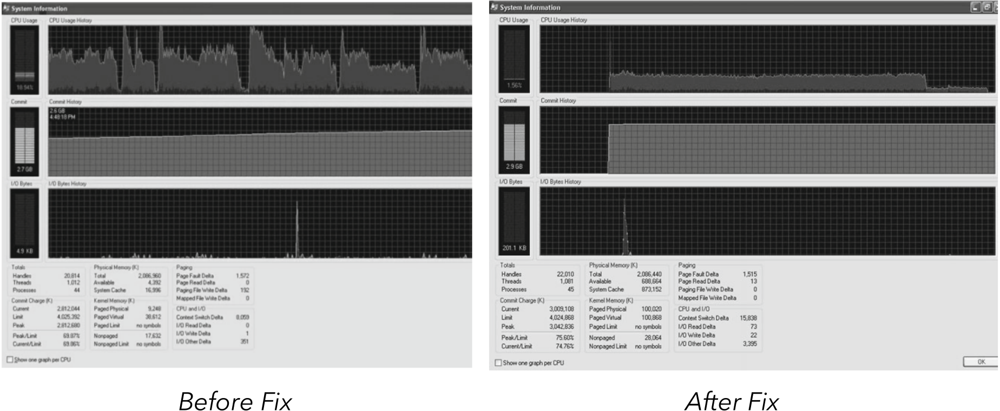
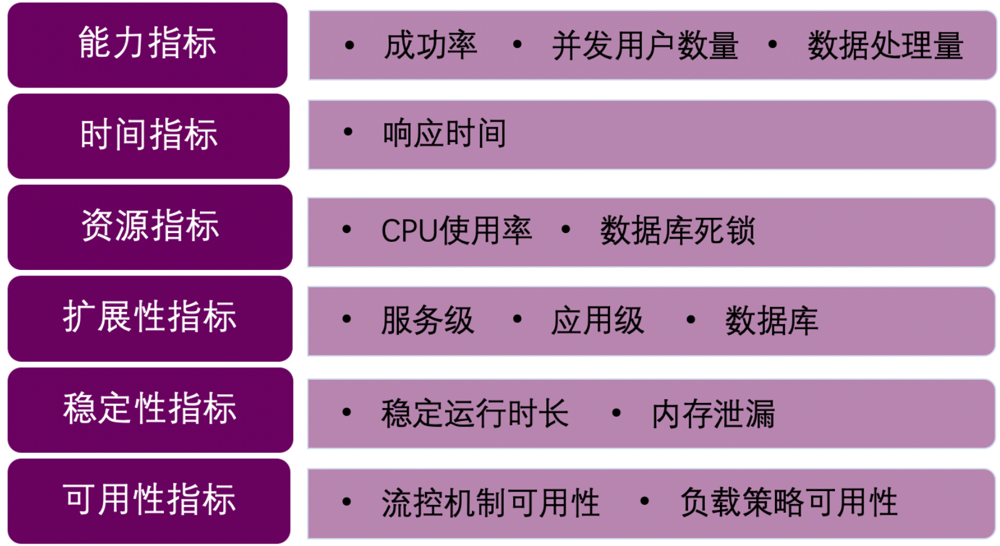
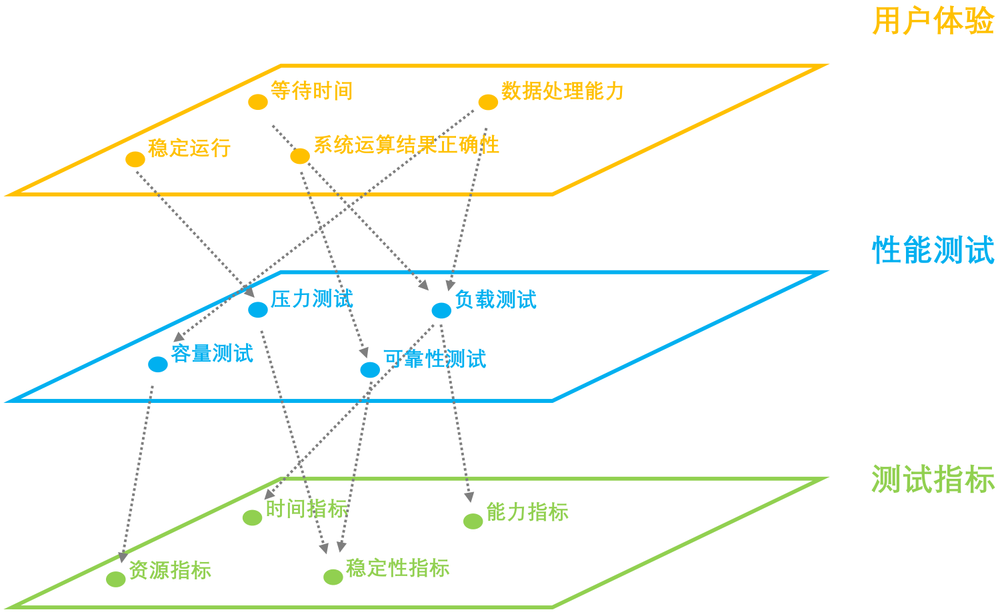

# 软件运行效率测试

## 软件运行效率测试

> 天下武功，唯快不破。

说到软件，你可能会想到自己笔记本电脑上有不少在本地运行的软件，但当下有很多大规模的基于Web的的软件。对于后者来说，非功能性的软件属性很重要。

* 检测问题：长时间的测试执行有助于**揭示程序中的隐含的问题**或冲突（e.g., memory leak）。当然，用静态程序分析的方法也能够完成memory leak的检测，而且从效果上来说比软件测试的方法更好。如果你感兴趣，可以到看看我的另一个公开Gitbook，在本书简介（github上的README也有）的末尾有相关链接。
* 评价性能指标：验证软件系统是否能够达到用户提出的**性能指标**，同时发现软件系统中存在的**性能瓶颈**
* 系统调优：通过不断调整、以及重复运行测试来**改进系统性能**
* 验证稳定性可靠性：在生产负荷下执行一定时间的测试是**评估系统稳定性和可靠性**的一种重要手段

  通常来说，对于一个基于Web的服务应用来说，其硬件利用率，吞吐量和响应时间与负载的关系如图所示：

1. 硬件利用率（服务器端的CPU、内存使用率等）
2. 吞吐量（有效运输的数据量）
3. 响应时间（字面意思，和用户体验密切相关）

## Load testing

> ​ 检测系统在不同负载下的表现。检测系统在不同负载下的表现。使系统承担不同的工作量，评估其在不同工作量下的行为、以及持续正常运行的能力。

通过负载测试，我们能够检测出：

* 功能相关的问题（e.g., deadlock）
* 非功能相关的问题（e.g., performance, reliability）

### 典型的系统负载模式

以学校教务网为例，我们可以这么理解：

* Normal\(正常学生选课\)
* Soak\(精明的脚本选课，用脚本一直刷新抢空位但控制频率\)
* Spike\(不加节制的脚本选课，让服务器超负荷，很容易被抓然后吃处分\)
* Break\(压力上不封顶，就是要看看怎样会把服务器搞坏\)

### 负载测试的设计执行

通常来说按照以下流程执行：

#### 设计负载的方式选择

接下来介绍实践中四种实际的设计Load的方式：

* Realistic
* Fault-inducing
* Live-user
* Driver-Based

**Realistic**

> ​ derive load from historic data \(note that field workloads might change over time\).

具体来说，Workload会有固定的比例，如以电商网站为例，可能大部分流量都是浏览的。其次，测试时可以步进式的增加强度。

注意需要随着软件的发展及时更新Workload Mix Profile。例如，一个电商网站在不同时候用户进行不同行为的比例可能会有较大的变化。

**Fault-inducing**

> Identifies potential load sensitive modules and regions for load sensitive faults \(e.g., memory leaks, incorrect dynamic memory allocation\)

一句话举例子解释：由静态程序分析的方法或建模的方法找到可能产生memory leak的程序点，针对这样可能产生问题的点进行动态的测试）。

**Live-user**

> ​ 请大量的真实用户来进行测试。

优缺点都很明显：

* 优点：能够反应用户的真实行为，也能够得到真实用户对于性能的直观反馈
* 缺点：难以扩大规模（Hard to scale），测试的复杂度受限（Limited test complexity due to manual coordination）

**Driver-based**

> ​ Use some specialized benchmarking tools \(e.g., LoadGen\), or centralized load drivers \(e.g, LoadRunner\)

* 优点：易于自动化，易于扩大规模
* 缺点：需要较为复杂的配置，也难以跟踪特定的系统行为（Hard to track some system behaviour ）如音频与图像的质量

#### 负载测试的过程

* Test Setup
  * tester recruitment, setup and training / programming and store-and-replay configuration …
* Load generation and termination
  * static configuration \(e.g., counter-driven, time-driven\) / dynamic feedback …
* Test monitoring and data collection
  * test monitoring tools \(e.g., Task Manager, Jconsole, App Dynamics\)

#### 负载测试结果的分析

**Verifying Against Threshold Values**

• Straight-forward comparison

• Comparison against processed data \(maximum, average, …\)

• What will the estimated reliability be?

**Detecting Known Problems Using Patterns**

* Patterns in the memory utilizations
* • Patterns in the logs \(error keywords\)

如左图是一个有死锁问题的程序执行时的CPU负载pattern，而右图为修复后的情况：

## Stress Testing

> 检测系统在**极限情况**下的表现。通过模拟负载，使系统在负载饱和或资源匮乏的状态下运行。可以被看作是负载测试的一种，即高负载下 的负载测试。

作用：了解系统的稳定性，明确系统在极端环境和压力下的表现，并发现系统在某些功能方面的隐患。

分类：

1. 稳定性压力测试：高负载下的长时间测试
2. 破坏性压力测试：极限负载情况下导致系统崩溃的测试

## Volume Testing

> 检测系统在**大数据量或大量用户**下的表现

* 容量测试通常和数据库有关
* 容量测试通常仅关注大容量，而不表现实际的使用

## Performance Testing

> 评估系统的**性能指标**。

* 使用自动化的测试工具来模拟多种正常、峰值以及

  异常的负载条件

* 获取软件的性能指标，发现瓶颈并优化软件

## Summary

**面向指标评估**

* 性能测试：评估系统性能

**面向缺陷发现**

* 负载测试：在不同负载下的表现
* 压力测试：在高负载和极端条件下长时间运行的稳定性
* 容量测试：在大数据量下的表现

