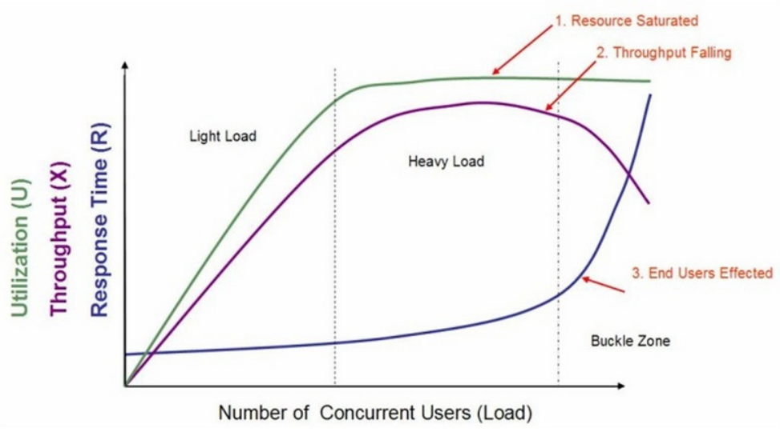
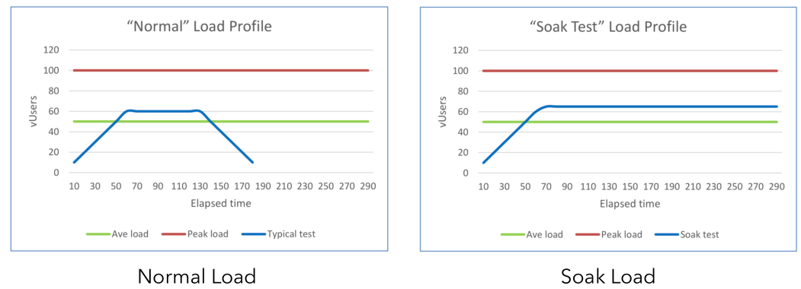
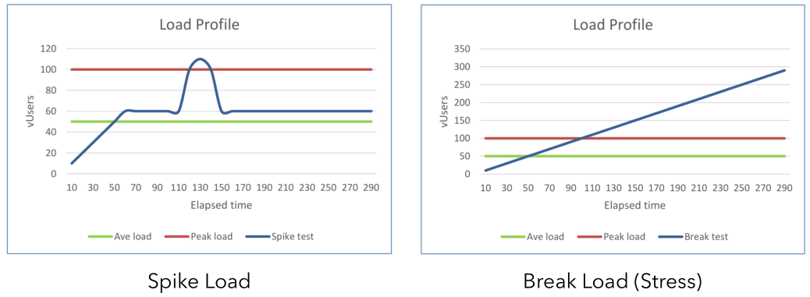
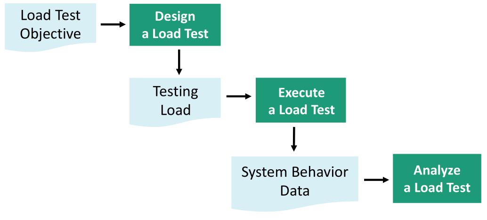
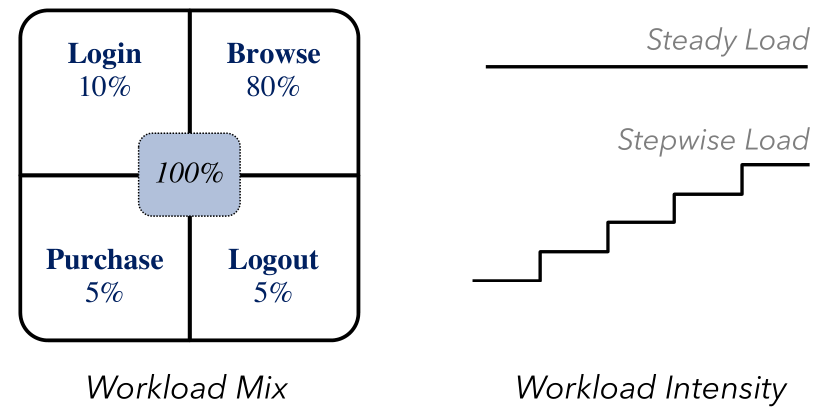

# 软件运行效率测试

说到软件，你可能会想到自己笔记本电脑上有不少在本地运行的软件，但当下有很多大规模的基于Web的的软件。对于后者来说，非功能性的软件属性很重要。

-   检测问题：长时间的测试执行有助于**揭示程序中的隐含的问题**或冲突（e.g., memory leak）。<u>当然，用静态程序分析的方法也能够完成memory leak的检测，而且从效果上来说比软件测试的方法更好。如果你感兴趣，可以到看看我的另一个公开Gitbook，在本书简介（github上的README也有）的末尾有相关链接。</u>
-   评价性能指标：验证软件系统是否能够达到用户提出的**性能指标**，同时发现软件系统中存在的**性能瓶颈**
-   系统调优：通过不断调整、以及重复运行测试来**改进系统性能**
-   验证稳定性可靠性：在生产负荷下执行一定时间的测试是**评估系统稳定性和可靠性**的一种重要手段

 通常来说，对于一个基于Web的服务应用来说，其硬件利用率，吞吐量和响应时间与负载的关系如图所示：

1.  硬件利用率（服务器端的CPU、内存使用率等）
2.  吞吐量（有效运输的数据量）
3.  响应时间（字面意思，和用户体验密切相关）

# 负载测试（Load testing）

>   ​	检测系统在不同负载下的表现。检测系统在不同负载下的表现。使系统承担不同的工作量，评估其在不同工作量下的行为、以及持续正常运行的能力。

通过负载测试，我们能够检测出：

-   功能相关的问题（e.g., deadlock）
-   非功能相关的问题（e.g., performance, reliability）

## 典型的系统负载模式

以学校教务网为例，我们可以这么理解：

-   Normal(正常学生选课)
-   Soak(精明的脚本选课，用脚本一直刷新抢空位但控制频率)
-   Spike(不加节制的脚本选课，让服务器超负荷，很容易被抓然后吃处分)
-   Break(压力上不封顶，就是要看看怎样会把服务器搞坏)

## 负载测试的执行

通常来说按照以下流程执行：

接下来介绍实践中的四种实际的设计Load的方式：

### Realistic

>   ​	derive load from historic data (note that field workloads might change over time).

具体来说，Workload会有固定的比例，如以电商网站为例，可能大部分流量都是浏览的。其次，测试时可以步进式的增加强度。

<u>注意需要随着软件的发展及时更新Workload Mix Profile。</u>

### Fault-inducing

>   Identifies potential load sensitive modules and regions for load sensitive faults  (e.g., memory leaks, incorrect dynamic memory allocation)

一句话举例子解释：由静态程序分析的方法或建模的方法找到可能产生memory leak的程序点，针对这样可能产生问题的点进行动态的测试）。

### Live-user

（优缺点都很明显）

### Driver-basic

（经常被使用，缺点是需要较为复杂的配置，也难以track相关的表现）

（TODO-引用PPT）Pattern-based: 例-Fix deadlock

Stress Testing

Performance Testing

小结

（TODO：在录音里摘录Reliability和Dependability的内容）

可靠性：指标？

Operational profile based 

-   定义
-   启发和做法
-   Tips

安全测试

-   重要性
-   分类举例
-   细分
    -   用户认证-who are you?
    -   用户授权-what can you do?