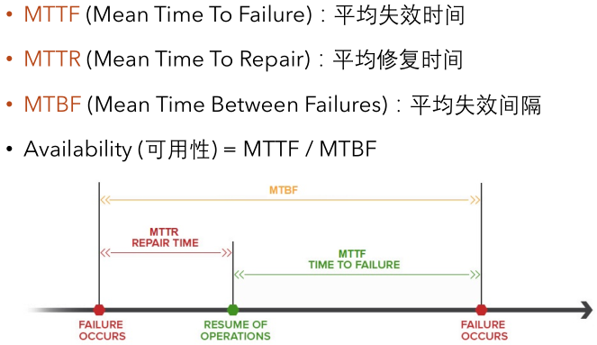
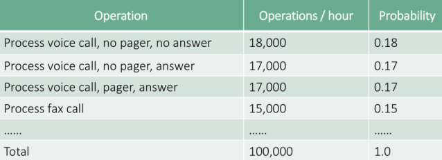
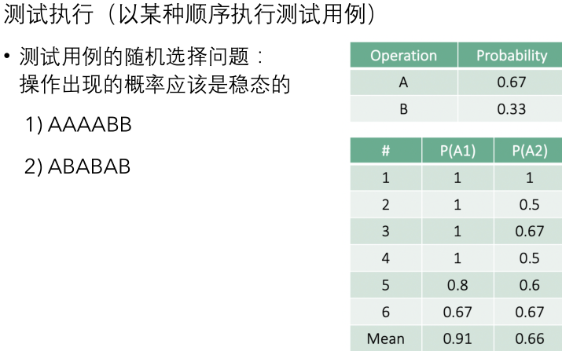
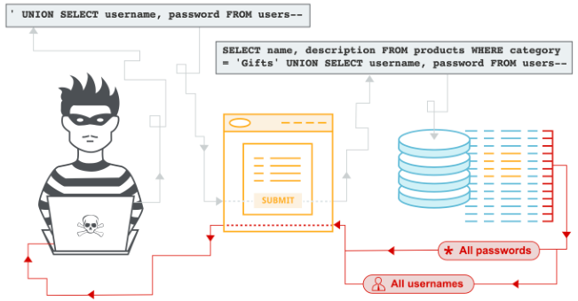
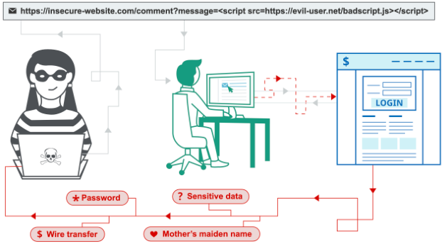
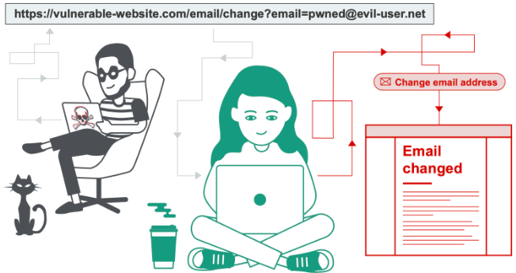

# 软件可靠性与安全性的测试

# Reliability Testing

>   ​	评估软件的**可靠程度**。

软件可靠性：软件在**规定的时间**和**规定的环境**下，**完成规定功能**的能力。

## 软件可靠性度量指标

## 基于操作剖面的测试

Operational profile based testing的定义:

>   描述用户如何使用软件的一种技术，是一系列操作及其出现概率的集合。

-   如果软件系统运行过程中某几个操作序列运行频率高，而且
    这几个操作的可靠性也高，那么软件的可靠性相对就较高。因此我们希望尽可能地增加关键操作的执行概率。
-   通过构建软件系统的操作剖面，可以有效地指导软件可靠性
    测试，合理分布资源，提高测试效率（使经常使用的操作得
    到更多测试）

具体执行时的细节问题：

又右下角的图看出用第二个序列更能维持操作概率的稳定，故第二个测试序列效果更好。

# Security Testing

>   检测软件**安全控制机制**的正确性和有效性。

-   采用功能验证、漏洞扫描、模拟攻击等多种方法对用户管理、权限管理、加密系统、认证系统等与安全相关的功能进行测试，验证软件系统危险防止和危险处理的能力
-   **安全是相对的**：攻破系统必须付出比获得的利益更多的代价时，非法入侵便失去意义

从分类上来说，大体可以分为两类：

1.  安全功能测试
    -    测试软件实现是否与安全需求说明一致
    -   数据机密性、完整性、不可否认性、身份认证、授权、访问控制、审计、隐私保护、安全管理等
2.  安全漏洞测试
    -   从攻击者的角度，以发现软件的安全漏洞为目的
    -   系统在设计、实现、操作、管理上存在的可被利用的缺陷或弱点，这些漏洞可能造成软件受到攻击，使软件进入不安全的状态

以Web应用的安全问题举例（有兴趣的读者可以去查看[The Open Web Application Security Project(OWASP)的网站](https://owasp.org)）相关的问题包括但不仅限于：

-   SQL 注入

-   跨站脚本攻击（XSS）

-   跨站请求伪造攻击（CSRF）

一些常见的安全性测试方法有：

-   Static Analysis
-   Fuzzing
-   Syntax Testing
-   Fault Based Testing
-   ...

# Authentication Testing

>检测软件是否能正确**识别用户**信息。解决"who are you?"的问题。

 Authentication is the process of attempting to verify the digital identity of the sender of a communication. i.e.

-   Credentials Transported over an Encrypted Channel
-   Weak lock out mechanism (brute force passwords)
-   Bypassing authentication schema
-   Remember password functionality
-   Browser cache weakness (do not store sensitive data)
-   Weak password policy
-   Weak password change or reset functionalities
-   Weaker authentication in alternative channel
-   ...

# Authorization Testing

>   检测软件的各类资源是否经**允许**才能被使用。解决"what can you do?"的问题。

 Authorization is the concept of allowing access to resources only to those permitted to use them. i.e.

-   Directory traversal/file include
-   Bypassing authorization schema
-   Privilege Escalation (cannot modify users’ privileges)
-   Insecure Direct Object References (do not provide direct access to objects based on user’ input)
-   ...

# Bypass Testing

>   ​	检测用户是否能**绕过**软件的**输入验证**机制。

-   Value level bypassing: whether a software system adequately evaluates invalid inputs
-   Parameter level bypassing: address issues related to built-in input parameter selection, built-in data access 

