# 软件用户友好性的测试

## 软件用户友好性的测试

> 阅读完本小节，你能更好地理解并阐述——什么是一个优秀的软件？

## Compatibility Testing

> 检测软件能否在**不同的硬件平台、不同的操作系统和不同的网络环境之上、以及不同的应用之间**正常运行。

分类如下：

* Hardware & Operating System & Device & Browsers: checks software to be compatible with different hardware configurations, operating systems, devices, and browsers
  * VLC视频播放器是一个全平台软件的优秀例子
* Data: check data and files to be compatible with public standards
  * WPS/LibreOffice能够一定程度上兼容微软的文档格式
* Different Software: checks software to be compatible with other software
  * 经历过2008年3Q大战的读者应该都能理解，在当时，360和QQ之间只能选择性安装一个。
* Versions of the Software: checks software to be compatible with different versions of the software
* Backward/Forward Compatibility Testing: verify the behavior and compatibility of the developed hardware or software with their **older/newer** versions \(respectively\) of the hardware or software
  * 基于Python 2编写的项目代码想要迁移到Python 3，用Jekyll 2完成的博客框架想要迁移到Jekyll 4的痛苦，经历过的同学应该都能体会。

具体测试步骤如下：

1. Define the set of platforms or environments that the application is expected to work on
2. **Design different configurations \(test cases\)**
3. Execute tests and analyze results

## Configuration Testing

> 检测软件在**不同的软硬件配置环境**下是否能正常工作。

* The variability of \(highly\) configurable software systems: software systems that can be configured to different hardware platforms, operating systems, and requirements 
* A very typical **combinatorial explosion problem**

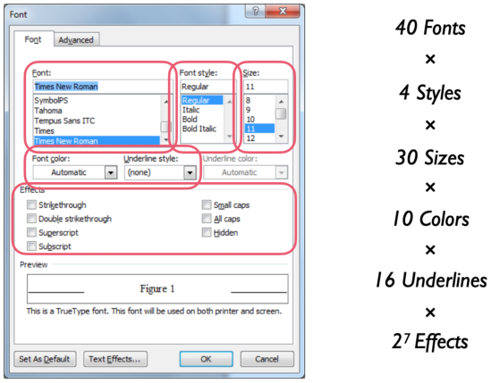

Yet another example: 软件在特定的配置下可能会在运行时崩溃：

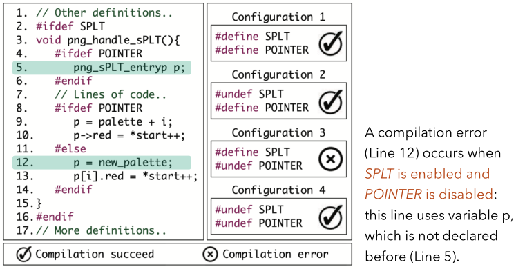

为了测试上述代码，我们可以有不同的方式来设计测试用例集：

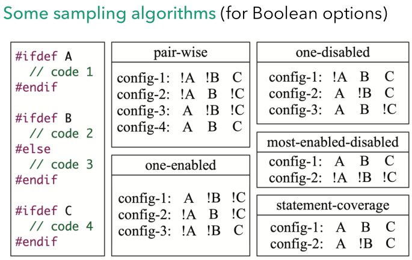

## Graphical User Interface \(GUI\) Testing

> 检测软件的人机**图形交互界面**是否满足用户要求。

* Event driven architecture\(user actions create events\)
  * 以安卓和iOS移动应用为例，用户的行为导致了图形界面的跳转
* Another typical **combinatorial explosion problem**
  * 每个界面都有各种按钮，移动应用上还有Home Button和各种手势。这同样是组合爆炸的问题。

如何设计测试用例？

* Event selection and oracle specification
* Define coverage \(typically, model based\)
  * 通常来说分为以下两种抽象模型
  * Event Flow Graph\(EFG\)

    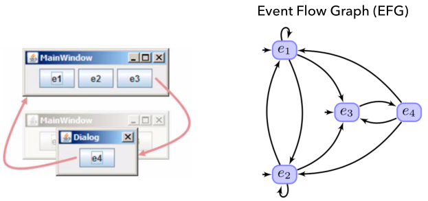

  * Finite State Machine\(FSM\)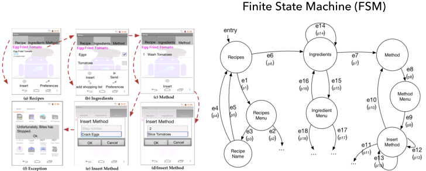

如何执行测试用例（谈谈自动化）？

* 手动输入并手动对比
  * 别笑，今年秋招真的有企业跟我说他们招聘的是手动执行测试的测试工程师
* 录屏并观察/应用脚本（设置开发者模式并通过数据线传递操作命令），
  * 例如使用Appium等框架结合Python/Java脚本对移动应用进行测试
* 用机器人辅助

  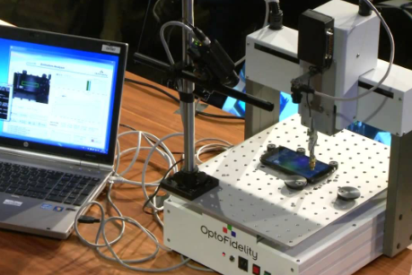

* ...

## Usability Testing

> ​ Usability Testing：评估软件的**易用程度**（人机交互）。

Keep users from having a successful and satisfying.

* Learnability: How easy is it for users to accomplish basic tasks the first time they encounter the design?
  * 能不能让用户不看手册，上手就用？
  * Anki的这项属性较差，有同学学了好多次都没有成功地使用这个复杂的软件
  * 有一系列安卓平台游戏的开始界面和用户引导非常优秀
    * Mini Metro
    * Alto's adventure
    * ...
* Efficiency: Once users have learned the design, how quickly can they perform tasks?
  * 熟练用户能很快地借助软件完成任务吗？
* Memorability: When users return to the design after a period of not using it, how easily can they re-establish proficiency?
  * 用户一年没用，回坑之后需要再学很多东西吗？
* Errors: How many errors do users make, how severe are these errors, and how easily can they recover from the errors?
  * 用户犯错的情况如何？他们能否轻松地应对？
  * Appium GUI的这项属性较差，作为程序员甚至无法通过阅读报错的日志信息明确定位自己填写的配置信息哪里不符合要求
* Satisfaction: How pleasant is it to use the design?
  * 用户主观感受如何，他们是否满意？

**Some Measures of Usability**

* Percentage of goals/tasks achieved \(success rate\)
* Time to complete a task
* Frequency of requests for help
* Ratings on a satisfaction scale
* number of good vs. bad features recalled after test
* number of times users express dissatisfaction or frustration
* number of  users who would use the system again
* ...

**如何执行测试**-Employs potential users to evaluate the degree to which a software meets predefined usability.

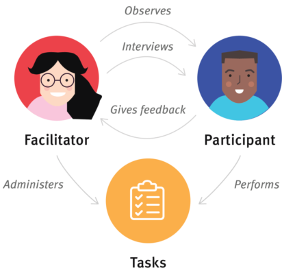

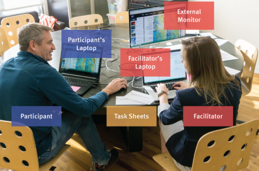

**执行时的细节**

1. Plan
   * Define what to test: activities \(use cases\)
   * Define which customers to be tested: people \(actors\)
   * Provide a background for the activities to test: context
2. Conduct
   * Start with an easy task to build confidence
   * Give participants time to think it through 
   * Lead participants, don’t answer questions \(Don’t solve their problems immediately\)
3. Analyze
   * Do not use participant names, use P1, P2, P3, etc.
   * Include quantitative data \(success rates, times, etc.\)
   * Use quotes & screenshots
   * Include recommendations

**用户设计的经典Nielsen准则**

对[Nielsen准则](https://medium.com/theagilemanager/user-experience-jakob-nielsens-10-general-principles-for-interaction-design-2593b0b53ddc)的具体内容感兴趣的读者可以做一些拓展阅读。

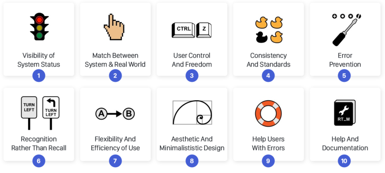

## Accessibility Testing

> 检测软件是否满足政府或软件行业颁布的可访问性规范，为**各类用户**扫除使用障碍。

**这不是一个不重要的问题。**

About 20% of the world's population lives with some form of disability.

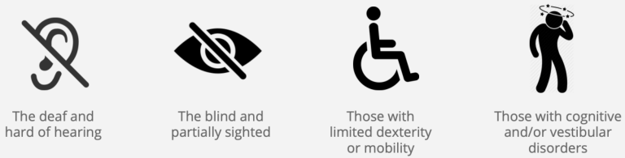

* [新闻：盲道修成蛇形，避让了窨井盖为难了盲人](https://www.thepaper.cn/newsDetail_forward_1684961)
* [新闻：盲人程序员：互联网给了我一个平等的机会](https://www.thepaper.cn/newsDetail_forward_2969328)

基于[WCAG](https://www.w3.org/WAI/standards-guidelines/wcag/) \(Web Content Accessibility Guidelines\)的常见标准：

* Perceivable: Make it easier for users to see and hear 

  content

* Operable: Help users navigate to and find content
* Understandable: Make content appear and operate 

  in predictable ways

* Robust: Maximize compatibility with current and 

举几个例子：

* Screen Reader\(VoiceOver in iOS\).Read the screen aloud with a voice synthesizer

  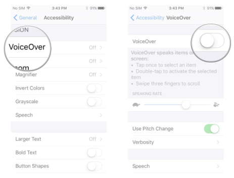

* Color & Contrast-Text have distinguishable colour, and good colour contrast compared to its background.
  * 考虑到红绿色盲的存在，不应该用红绿颜色表示软件中的重要操作
  * 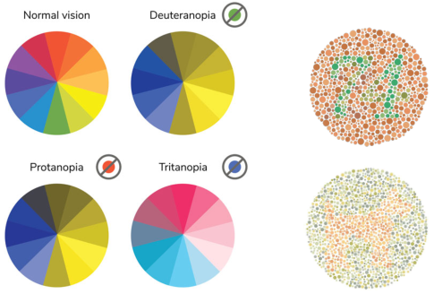
* Keyboard Only-Elements that are actionable with a mouse should also be actionable with a keyboard
  * i3wm与vim系列插件用户狂喜
  * 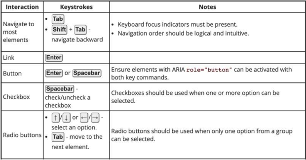
* Screen Magnifier- Elements \(which dynamically appear and change\) should be readable
  * 

**Accessibility helps everyone.**

Usability means designing software to be effective, efficient, and satisfying for **most people**. Accessibility makes sure it is effective, efficient, and satisfying for **more people** - especially people with disabilities.

### 安装测试 & 卸载测试（Installation & Uninstallation Testing）

> 对软件的**安装过程**或**卸载过程**进行测试。

有些类型的软件系统安装/卸载过程非常复杂，因此需要确保软件在各种情况下都能进行安装/卸载。如：

* 不同的安装（首次、升级、自定义 等）和卸载（软件自带程序、控制面板、第三方软件等）方式
* 针对磁盘空间不足、缺少目录创建权限等情况的处理
* 安装 & 卸载过程是否可以取消
* 安装 & 卸载过程是否可以回溯
* 安装 & 卸载过程中意外情况的处理是否符合需求（如死机、重启、断电等）
* 安装 & 卸载的用户界面提示

### 备份测试（Backup Testing）

> 对软件的**数据备份**进行测试。

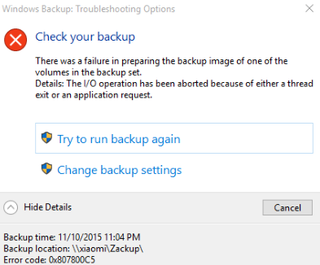

对软件的数据备份进行测试。主要关注：

* 备份方式
  * 双机热备/磁盘镜像或容错/备份磁带异地存放/关键部件冗余等
* 备份频率
  * 手工备份：手动执行数据备份。如利用[rsync](https://rsync.samba.org/)手动备份。
  * 定时备份（触发器备份）：每隔一段时间、或者在满足特点条件时自动对当前数据进行备份。如写一个脚本，借助[rsync](https://rsync.samba.org/)手动备份。
  * 针对极端意外情况的备份：停电等
* 备份质量
  * 是否成功备份？是否备份了所有需要备份的内容？备份的数据能否用于原始数据的恢复？
* 备份过程对系统的影响
  * 因为备份需要占用系统的资源，所以需要观察备份备份过程对于系统正常运作产生的影响，是否影响了其他功能
  * 如Dropbox启动后，笔者运行Linux的笔记本续航时长立刻打6折
* 备份文件管理及日志
  * 通常需要进行多次的备份，为了维护和恢复特定的文件版本，备份往往需要详细的日志，并及时清理过期备份文件

**一个有意思的备份基本思想：**

1. 至少在三处不同的地方保存数据
2. 至少在两个不同的存储介质上保存数据
   * 试想如果笔记本电脑和移动硬盘都装在一个包里，包遗失后，数据就会永远遗失
3. 在异地保留一份数据拷贝
   * 如利用各种网盘或自建备份服务器
   * 如发生某些意外事件（包括但不限于宿舍火灾，地震等），至少你还能从网盘里恢复自己的重要数据

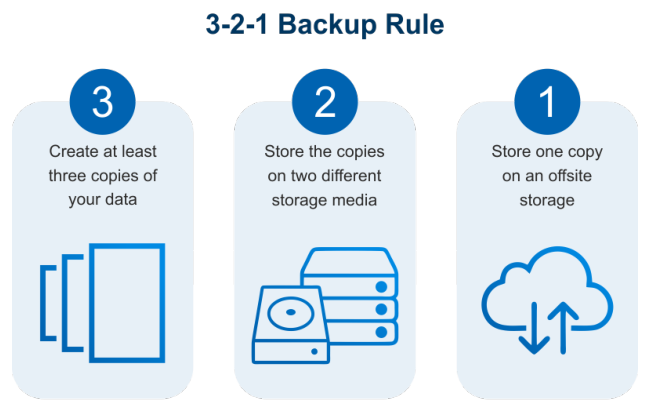

### 可恢复性测试（Recovery Testing）

> 测试一个软件在故障发生后（系统崩溃、硬件损坏或其他灾难性出错），**重新建立性能水平并恢复直接受影响数据**的能力。通常使用故障注入测试方法（Fault Injection Testing）而不是直接人为制造真实故障。

* Recovery Time Objectives \(RTO\) 
  * 故障后到恢复的时间作为指标
* Recovery Point Objectives \(RPO\)
  * 修复后到下一次故障发生的时间作为指标

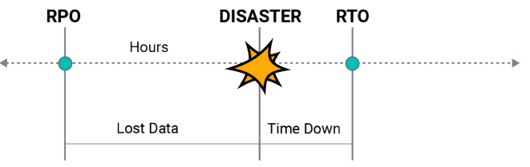

### 本地化和国际化测试（Localization and Internationalization Testing）

> 检测软件是否**针对不同地区**进行调整。

举两个正面例子：

1. Apple：

2.Microsoft：安装中文Windows系统时会请用户“坐和放宽”，并为用户念诗。

重要性-本地化的水平决定了软件的国际影响力和潜在的国际用户规模。

* Internationalization \(简称i18n-以i开头，以n结尾，共18个字母\): the practice of writing software which can easily be extended to support 

  users from multiple cultural and linguistic backgrounds

* Localization \(简称l10n\): the process of taking internationalized software and actually producing a version tailored to users from a particular culture and 

**本地化和国际化不仅涉及语言翻译，还需要考虑不同 国家的使用者如何理解并使用软件。**

* 阅读习惯

  1. 根据**阅读习惯**从左到右还是从右到左，可能需要**对UI做相应的调整**。
  2. 在有的语言中，**同样的意思需要用更大的空间**来表达，此时需要**对UI做相应的调整**。

  

* 同种语言在不同地区的差异
  1. 同是英文，英美的**拼写习惯**并不一致
  2. 不同区域的术语（ terminology）不一样，如cache在中国大陆通常翻译为"缓存"，而在港澳台地区则通常翻译为“快取”。一缓一快一存一取，看似矛盾，但表达的都是同一个意思。不能因为都是中文而照搬。
* 惯用单位与格式
  * 不同地区的惯用单位（货币单位，时间格式）不一致，如美国人听到kilometer一定会再追问："How many miles is it?"
* 文化习俗
  * 如日本的知名购物网站乐天和中国许多购物网站排版风格就不太一致
  * 美国电商亚马逊的网页设计更是没有东方的红色风
* 法律法规
  * 软件需要投放到国际上，需要符合当地的规范。
  * 如国内默认使用cookies，而国外网站则默认需要提示用户否则不能随意使用。不加注意可能会导致巨额赔款。

### More

* 一致性测试（Conformance Testing）：测试一个产品面是否符合指定的**标准**（标准认证）
* 数据转换测试（Data Conversion Testing）：测试软件的**数据转换**方法是是否有效
* 余量测试（Remainder Testing）：检测软件在执行时间和存储空间上是否**留有一定的余量**（容错能力）
* ……

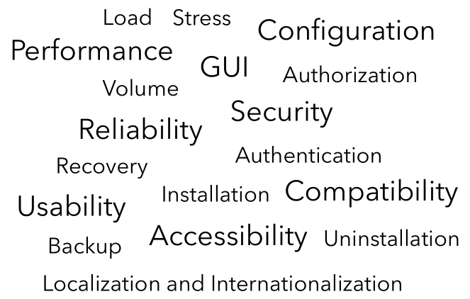

## Summary

在本小节，我们关注的是**软件是否好用**这一问题，阅读完上述内容，我希望所有的读者**不止能够说出软件是否好用，还能够说出是什么地方好用，什么地方不好用。**

