# 软件用户友好性的测试

# Compatibility Testing

>   检测软件能否在**不同的硬件平台、不同的操作系统和不同的网络环境之上、以及不同的应用之间**正常运行。

分类如下：

-   Hardware & Operating System & Device & Browsers: checks software to be compatible with different hardware configurations, operating systems, devices, and browsers
    -   VLC视频播放器是一个全平台软件的优秀例子
-   Data: check data and files to be compatible with public standards
    -   WPS/LibreOffice能够一定程度上兼容微软的文档格式
-   Different Software: checks software to be compatible with other software
    -   经历过2008年3Q大战的读者应该都能理解，在当时，360和QQ之间只能选择性安装一个。
-   Versions of the Software: checks software to be compatible with different versions of the software
    -   基于Python 2编写的项目代码想要迁移到Python 3，用Jekyll 2完成的博客框架想要迁移到Jekyll 4的痛苦，经历过的同学应该都能体会。
-   Backward/Forward Compatibility Testing: verify the behavior and compatibility of the developed hardware or software with their **older/newer** versions (respectively) of the hardware or software

具体测试步骤如下：

1. Define the set of platforms or environments that the application is expected to work on
2. **Design different configurations (test cases)**
3. Execute tests and analyze results

# Configuration Testing

>   检测软件在**不同的软硬件配置环境**下是否能正常工作。

-   The variability of (highly) configurable software systems: software systems that can be configured to different hardware platforms, operating systems, and requirements 
-   A very typical **combinatorial explosion problem**

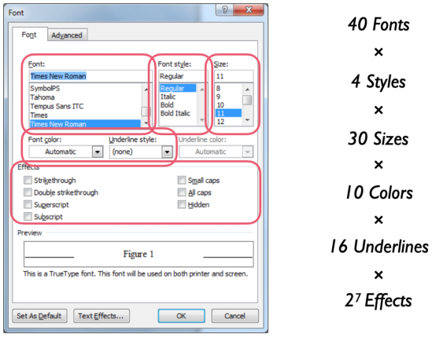

 Yet another example: 软件在特定的配置下可能会在运行时崩溃：

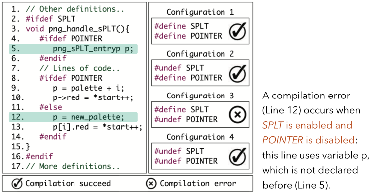

为了测试上述代码，我们可以有不同的方式来设计测试用例集：

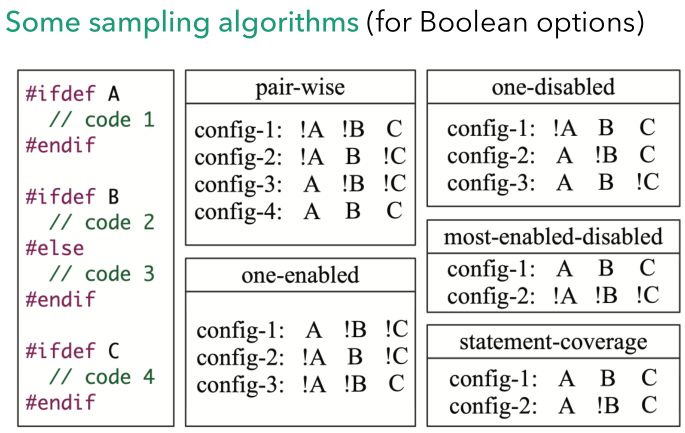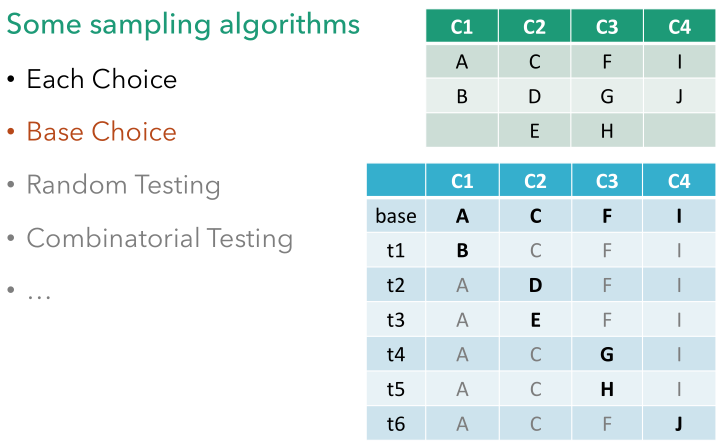

# Graphical User Interface (GUI) Testing

>   检测软件的人机**图形交互界面**是否满足用户要求。

-   Event driven architecture(user actions create events)
    -   以安卓和iOS移动应用为例，用户的行为导致了图形界面的跳转
-   Another typical **combinatorial explosion problem**
    -   每个界面都有各种按钮，移动应用上还有Home Button和各种手势。这同样是组合爆炸的问题。

如何设计测试用例？

-   Event selection and oracle specification

-   Define coverage (typically, model based)

    -   通常来说分为以下两种抽象模型

    -   Event Flow Graph(EFG)

        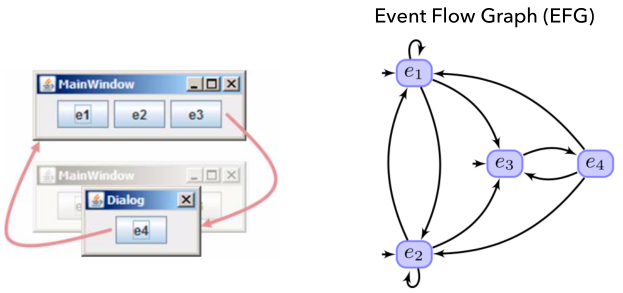

    -   Finite State Machine(FSM)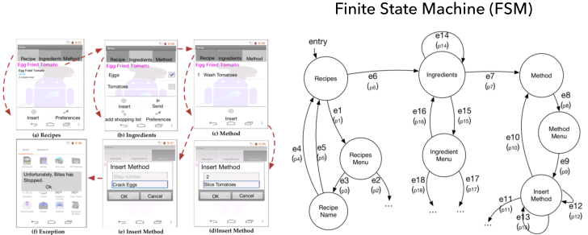

如何执行测试用例（谈谈自动化）？

-   手动输入并手动对比

    -   别笑，今年秋招真的有企业跟我说他们招聘的是手动执行测试的测试工程师

-   录屏并观察/应用脚本（设置开发者模式并通过数据线传递操作命令），

    -   例如使用Appium等框架结合Python/Java脚本对移动应用进行测试

-   用机器人辅助

    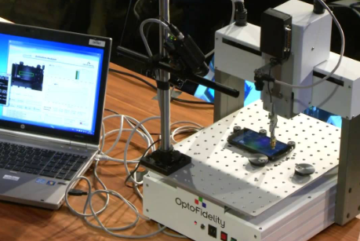

-   ...

# Usability Testing

>   ​	Usability Testing：评估软件的**易用程度**（人机交互）。

Keep users from having a successful and satisfying.

-   Learnability: How easy is it for users to accomplish basic tasks the first time they encounter the design?
    -   Anki的这项属性较差，有同学学了好多次都没有成功地使用这个复杂的软件
-   Efficiency: Once users have learned the design, how quickly can they perform tasks?
    -   有一系列安卓平台游戏的开始界面和用户引导非常优秀
        -   Mini Metro
        -   Alto's adventure
        -   ...
-   Memorability: When users return to the design after a period of not using it, how easily can they re-establish proficiency?
-   Errors: How many errors do users make, how severe are these errors, and how easily can they recover from the errors?
    -   Appium GUI的这项属性较差，作为程序员甚至无法通过阅读报错的日志信息明确定位自己填写的配置信息哪里不符合要求
-   Satisfaction: How pleasant is it to use the design?

# Accessibility Testing

>   检测软件是否满足政府或软件行业颁布的可访问性规范，为**各类用户**扫除使用障碍。

## 可用性测试（Usability Testing）

评估软件的易用程度（人机交互）。

-   Learnability: How easy is it for users to accomplish basic 
    tasks the first time they encounter the design?
    -   能不能让用户不看手册上手就用？
-   Efficiency: Once users have learned the design, how 
    quickly can they perform tasks?
    -   熟练用户能很快地借助软件完成任务吗？
-   Memorability: When users return to the design after a 
    period of not using it, how easily can they re-establish 
    proficiency?
    -   用户一年没用，回坑需要再学很多东西吗？
-   Errors: How many errors do users make, how severe are 
    these errors, and how easily can they recover from the errors?
    -   用户犯错的情况如何？
-   Satisfaction: How pleasant is it to use the design?
    -   用户主观感受满意吗？

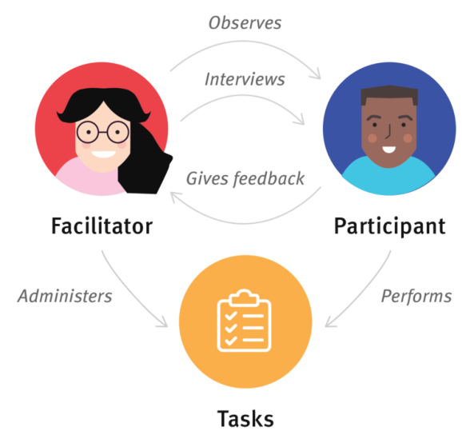

如何评估？（Some Measures of Usability）

如何进行？

用户设计的经典Nielsen准则

## 可访问性测试（Accessibility Testing）

检测软件是否满足政府或软件行业颁布的可访问性规范，为各类用户扫除使用障碍。

**这不是一个不重要的问题。**

About 20% of the world's population lives with some form of disability.

Apple公司操作系统的Accessibility方面做得较好。

常见标准：

-   Perceivable: Make it easier for users to see and hear 
    content
-   Operable: Help users navigate to and find content
-   Understandable: Make content appear and operate 
    in predictable ways
-   Robust: Maximize compatibility with current and 

举例：

-   Screen Reader（Voice Over in iOS）
-   Color & Contrast-Text have distinguishable colour, and good colour contrast compared to its background.
    -   考虑到红绿色盲的存在，不应该用红绿颜色表示软件中的重要操作
-   Keyboard Only-Elements that are actionable with a mouse should also be actionable with a keyboard
-   Screen Magnifier- Elements (which dynamically appear and change) should be readable 

**Accessibility helps everyone.**

Usability means designing software to be effective, efficient, and satisfying for most people.

Accessibility makes sure it is effective, efficient, and satisfying for more people — especially people with disabilities.

## 安装测试 & 卸载测试（Installation & Uninstallation Testing）

有些类型的软件系统安装/卸载过程非常复杂，因此需要确保软件在各种情况下都能进行安装/卸载。如：

-   不同的安装（首次、升级、自定义 等）和卸载（软件自
    带程序、控制面板、第三方软件等）方式
-   针对磁盘空间不足、缺少目录创建权限等情况的处理
-   安装 & 卸载过程是否可以取消
-   安装 & 卸载过程是否可以回溯
-   安装 & 卸载过程中意外情况的处理是否符合需求（如死
    机、重启、断电等）
-   安装 & 卸载的用户界面提示

## 备份测试（Backup Testing）

对软件的数据备份进行测试。主要关注：

-   备份方式
-   备份频率
-   备份质量
-   备份过程对系统的影响
-   备份文件管理及日志

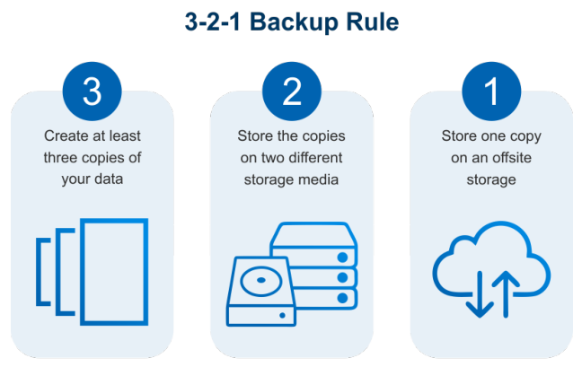

## 可恢复性测试（Recovery Testing）

测试一个软件在故障发生后（系统崩溃、硬件损坏或其他灾难性出错），重新建立性能水平并恢复直接受影响数据的能力。通常使用故障注入测试方法（Fault Injection Testing）而不是直接人为制造真实故障。

 -	Recovery Time Objectives (RTO) 
     -	故障后到恢复的时间作为指标
 -	Recovery Point Objectives (RPO)
     -	修复后到下一次故障发生的时间作为指标

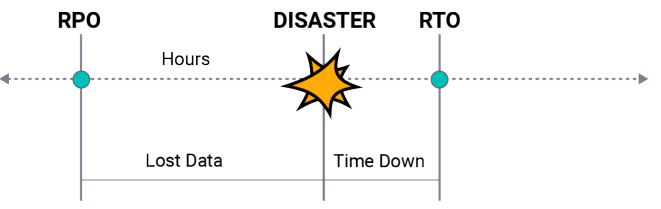

## 本地化和国际化测试（Localization and Internationalization Testing）

检测软件是否针对不同地区进行调整。Software’s global reach – potential global user base。

-   Internationalization (简称i18n-以i开头，以n结尾，共18个字母): the practice of writing software which can easily be extended to support 
    users from multiple cultural and linguistic backgrounds
-   Localization (简称l10n): the process of taking internationalized software and actually producing a version tailored to users from a particular culture and 

好例子：

1.    Apple：

      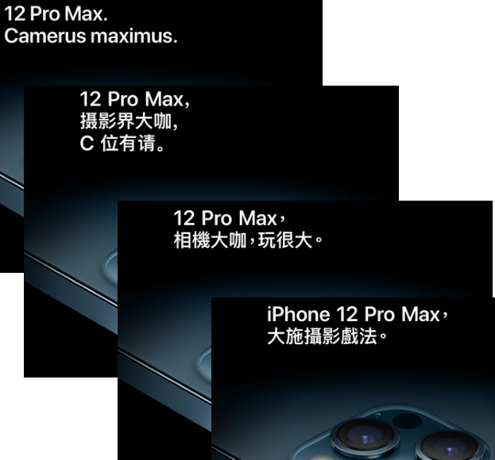

2.    Microsoft：

      安装中文Windows系统时会为用户念诗。

**本地化和国际化不仅涉及语言翻译，还需要考虑不同
国家的使用者如何理解并使用软件。**

-   阅读习惯

    1.  根据**阅读习惯**从左到右还是从右到左，可能需要**对UI做相应的调整**。
    2.  在有的语言中，**同样的意思需要用更大的空间**来表达，此时需要**对UI做相应的调整**。

    

-   同种语言在不同地区的差异

    1.  同是英文，英美的**拼写习惯**并不一致
    2.  不同区域的术语（ terminology）不一样，如cache在中国大陆通常翻译为"缓存"，而在港澳台地区则通常翻译为“快取”。一缓一快一存一取，看似矛盾，但表达的都是同一个意思。不能因为都是中文而照搬。

-   惯用单位与格式

    -   不同地区的惯用单位（货币单位，时间格式）不一致，如美国人听到kilometer一定会再追问："How many miles is it?"

-   文化习俗

    -   如Booking.com是一个做得很好的例子。

-   法律法规

    -   软件需要投放到国际上，需要符合当地的规范。
    -   如国内默认使用cookies，而国外网站则默认需要提示用户否则不能随意使用。不加注意可能会导致巨额赔款。

## More

-   一致性测试（Conformance Testing）：测试一个产品面是否符合指定的**标准**（标准认证）
-   数据转换测试（Data Conversion Testing）：测试软件的**数据转换**方法是是否有效
-   余量测试（Remainder Testing）：检测软件在执行时间和存储空间上是否**留有一定的余量**（容错能力）
-   ……

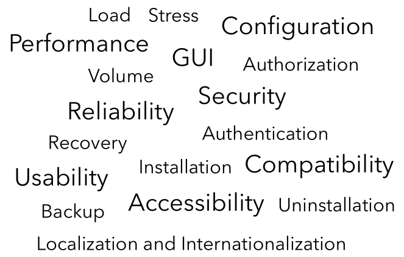

-   软件好用吗？
    -   哪里好用？
    -   哪里不好用？

