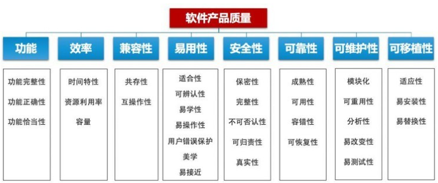
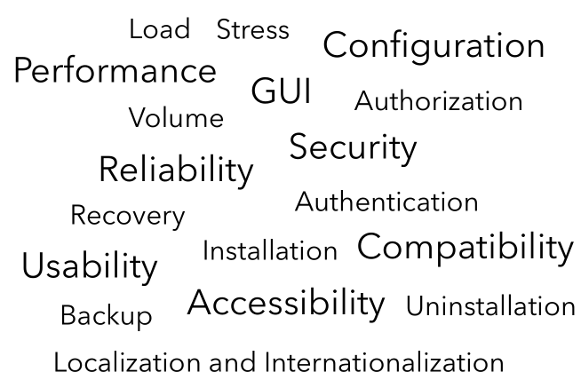

# 软件特性方面的测试方法

## 承前

针对前面课程的小结：

-   首先，**根据是否查看代码**，我们最初利用将测试分为White/Black两类，在两种测试分类中分别测试软件已经实现/规定要实现的行为。
-   然后，**根据软件开发的不同阶段**，介绍了从单元测试到系统测试，再到回归测试的几种大的测试分类。

## 启后

设想一个空间中的xyz-O座标系，其中x轴代表是否关注代码的内容，y轴代表软件当前开发的阶段，在本次课程中，我们介绍z轴——和**软件特性**相关的测试方法。**在前两小节中，我们主要关注软件的功能性；而在这一小节中，我们主要关注在系统测试层面软件非功能性的相关指标。**

<u>本课程试图介绍软件测试方法学的方法体系，本小节将帮助你理解较为活跃的数十上百种方法。</u>具体来说，我们会在本章中讨论下图的大部分软件质量指标。使用的测试方法一般是黑盒的系统测试。 

