# Yet Another Article on Compatibility Testing

# Who?

首先，Compatibility Testing不是Compatibility Test。

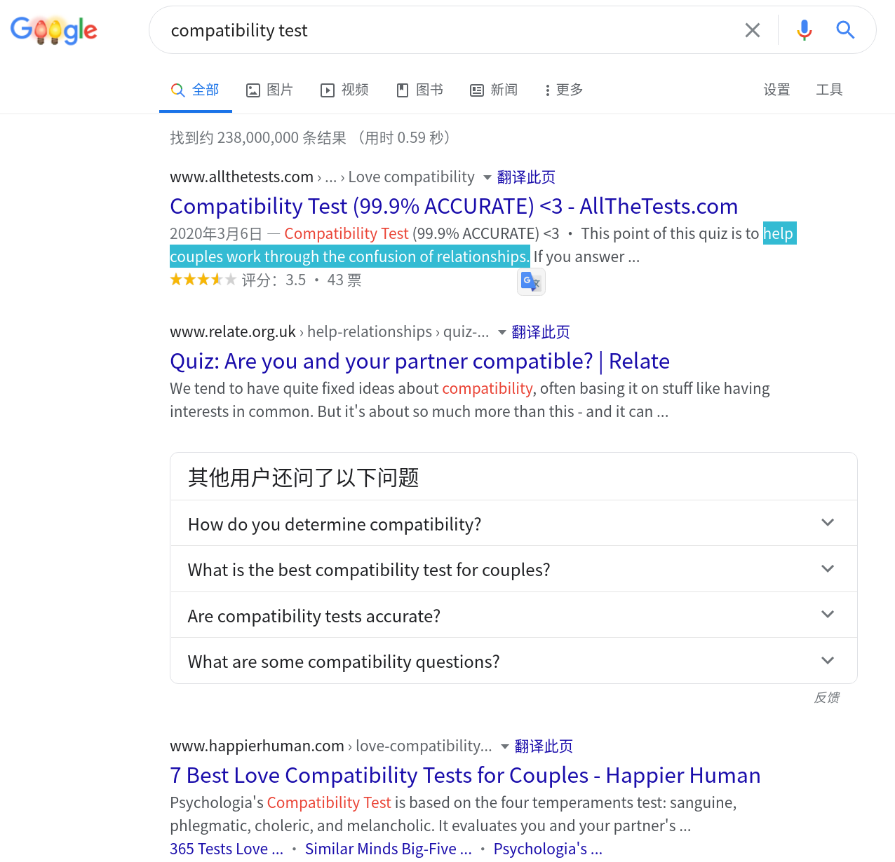

如果有人愿意阅读Wiki的定义：

>   Compatibility testing is a part of non-functional testing conducted on application software to ensure the application's compatibility with different computing environment.
>
>   The ISO 25010 standard, (System and Software Quality Models) defines compatibility as a characteristic or degree to which a software system can exchange information with other systems whilst sharing the same software and hardware. The degree to which a product can perform its required functions efficiently while sharing a common environment and resources with other products, without detrimental impact on any other product is known as co-existence while interoperability is the degree to which two or more systems, products or components can exchange information and use the information that has been exchanged. In these contexts, compatibility testing would be information gathering about a product or software system to determine the extent of coexistance and interoperability exhibited in the system under test.

在之前的课堂上，老师是[这样](https://st-intro.pblo.gq/ch4/04-03-user-friendly-testing#compatibility-testing)介绍的。一句话总结：

>   ​	检测软件能否在**不同的硬件平台、不同的操作系统和不同的网络环境之上、以及不同的应用之间**正常运行。

# Why?

>   我们真的需要兼容性测试吗？

## Yes

**需要——我在实际生活中遇到众多的兼容性问题。**

-   Web兼容。
    -   在原生安卓手机上运行的Chrome浏览网页时，GitHub和Email的图标和背景错位：
    -   
    
-   移动应用兼容。

    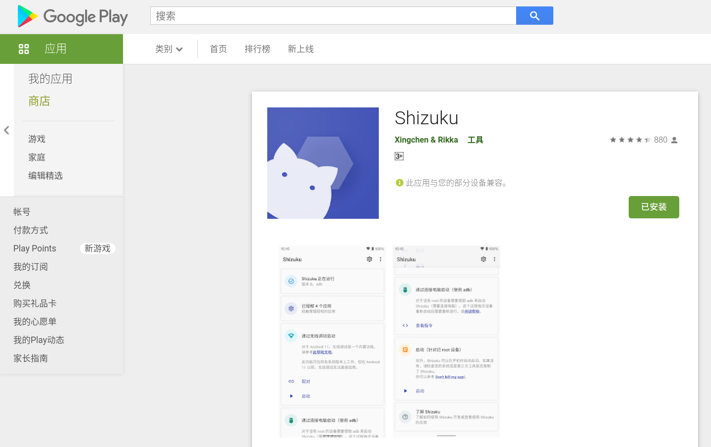

    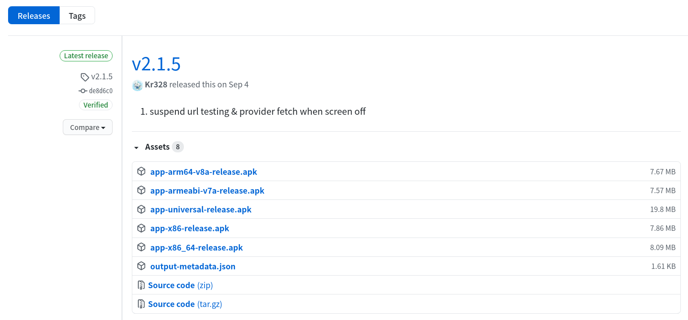

-   [网页静态生成器](https://github.com/stkevintan/canoe-blog)不向后兼容。
    -   [Jekyll](https://jekyllrb.com/)——数年间这个生成器的大版本号从2跳跃到了4，好多古老的博客模板因此失去了活力。
    

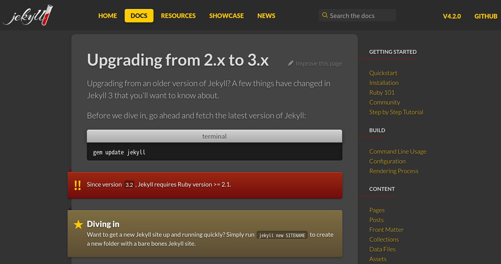
   

## Or No?

**不需要——只需要用户或开发者付出一点点额外的金钱/精力/时间，就能避开绝大多数兼容性问题。**

-   Chrome浏览器几乎已经在事实上确立了浏览器界的垄断地位，（听说）几乎所有的网页都会特别针对Chrome浏览器做优化和测试。
    -   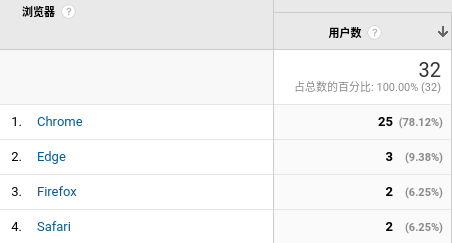
-   同样是之前的APP发布界面，只要用户能够忍受下载文件体积更大的universal版本apk，就不需要费心去查看自己设备的处理器架构。
-   Windows(尤其是Windows To Go)为了保证兼容性，不得不把大部分通用的驱动内置在操作系统内核中，这固然会在一定程度上“浪费”存储空间，但这能保证Windows系统能在各种不同硬件设备上正常运行。

# How

软件本身的Forward/Backward Compatibility以及类似于MS Office套件的Data Compatibility取决于开发者的想法——开发者不想让用户在不同的平台上使用，或者希望用户尽快地更新并使用新版本的现象还是很常见的。而网页的兼容性测试，一定程度上因为Chrome的事实垄断地位显得不太必要——毕竟只要在Chrome上运行正常，就能让80%左右的用户正常访问。

而移动APP方向，Apple的产品线和生态都相对闭合，而Android系统的碎片化则相对比较严重，比如在[这篇文章](https://new.qq.com/omn/20191015/20191015A03JFM00.html)里写到：

>   什么是碎片化？举个例子，1000 个 Android 手机制造商拿到 Android 内核之后，可以制造出 1000 种搭载不同硬件平台、界面的 Android 手机，虽然它们仍是基于 Android ，但其实已经不再是原来的 Android 了。经过一系列改造之后，每个手机制造商都拥有一个“独立”的 Android ，这就是**碎片化**。碎片化会导致的常见问题有：**想下载一款应用，但是每次下载都失败；手机一登录 App 就死机，只能删掉；每次进行到游戏最关键的环节就闪退……这些问题归根结底就是 App 的适配性问题。**用户设备种类那么多，产品如何匹配？如何保证产品在不同平台及版本、不同网络制式、不同分辨率和机型都有很好的用户体验呢？

所以在实践上，就选择~~最为方便的~~**移动APP测试**。这一方面在工业上已经有很多开放的平台了，如国内爱让员工加班的大厂们都有自己的平台。仔细阅读他们他们测试的思路都是一样的——在后台准备好数量众多的真机，然后等用户上传apk后，在后台进行一系列预定义的测试，如“AI遍历UI”，“Monky测试”等。

# Practice(Play with it)

-   Reality:  选择一个有3.3k star的Github项目[AntennaPod](https://antennapod.org/)，Google Play评分4.7分，已经有超过50万次下载。
-   Depth：
-   Automation：
-   Real bug in real software
-   Comparison?

测试方法介绍（参考框架）：目标、方法、优缺点、发展现状等

测试实践：待测软件的基本情况、测试流程、测试执行环境、测试结果和讨论等（可复现）

1.  从[F-Droid](https://f-droid.org/packages/de.danoeh.antennapod/)下载2020年11月3日更新的2.0.3版本apk文件
2.  可免费试用的云测试平台上进行测试
    1.  
    2.  
3.  查看结果

## 一个敷衍的结果

这个网站的所谓免费试用测试就是帮你在不同的老手机上初始化、安装、启动、卸载……

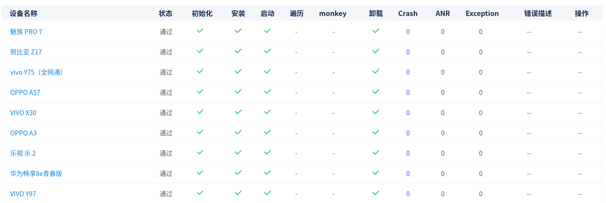

**但是！**

依然在46个机型的测试中，发现了2处Crash和17处Exception。

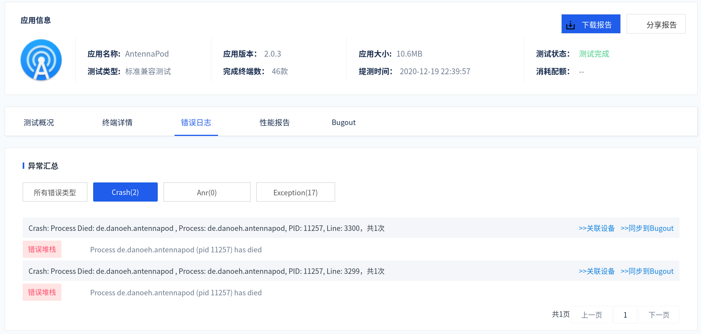

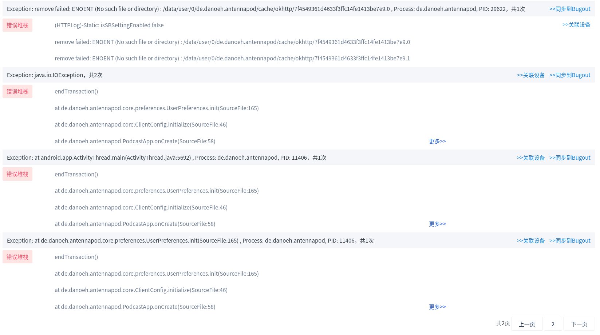

此外，还有一些有趣的性能分析：

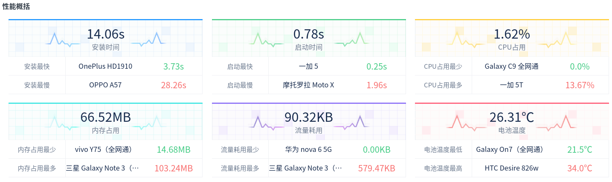

## 一个更为详尽的结果

前一份报告大约十分钟就完成了，这一份报告则测试得更为仔细，在49台设备上也只用了二十分就上完成了报告。

大约有十分之一的机型上出现了比较严重的问题，比如在3台三星的手机上应用直接crash了。

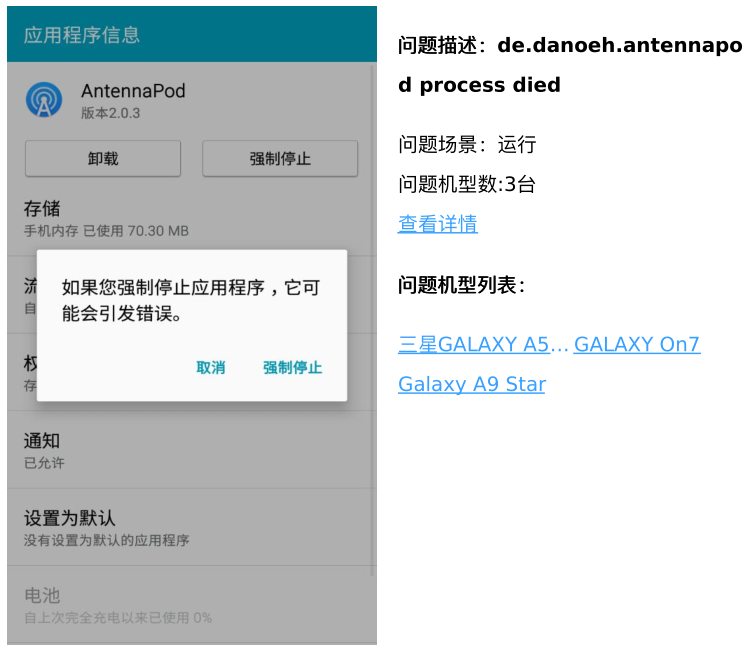

另外在华为和摩托罗拉的手机上应用运行时黑屏。

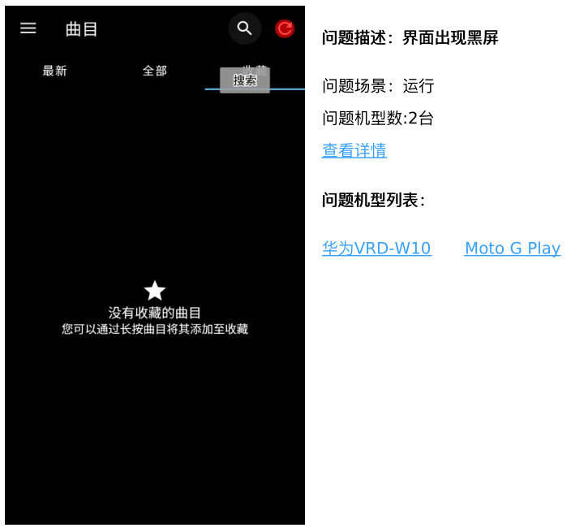

此外这个平台的PDF测试报告做得也很友好，能够检测的兼容性问题类型也覆盖了主要应用场景，总体体验良好。

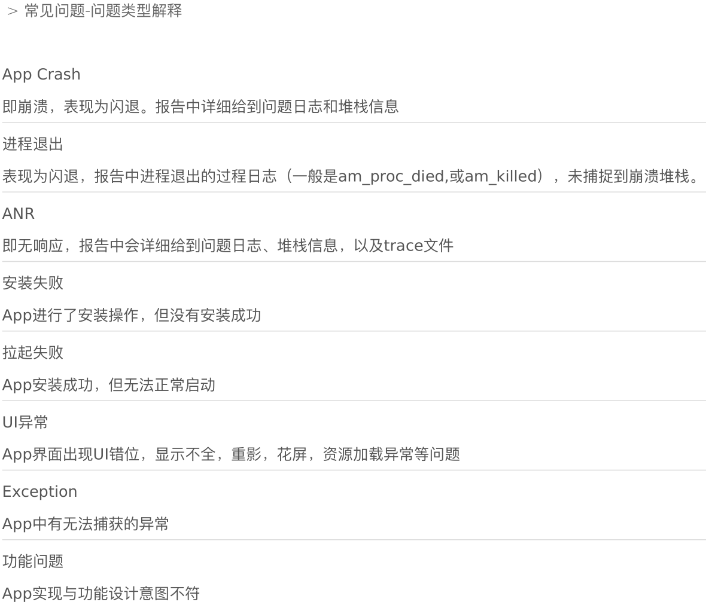

甚至还能做静态检查！

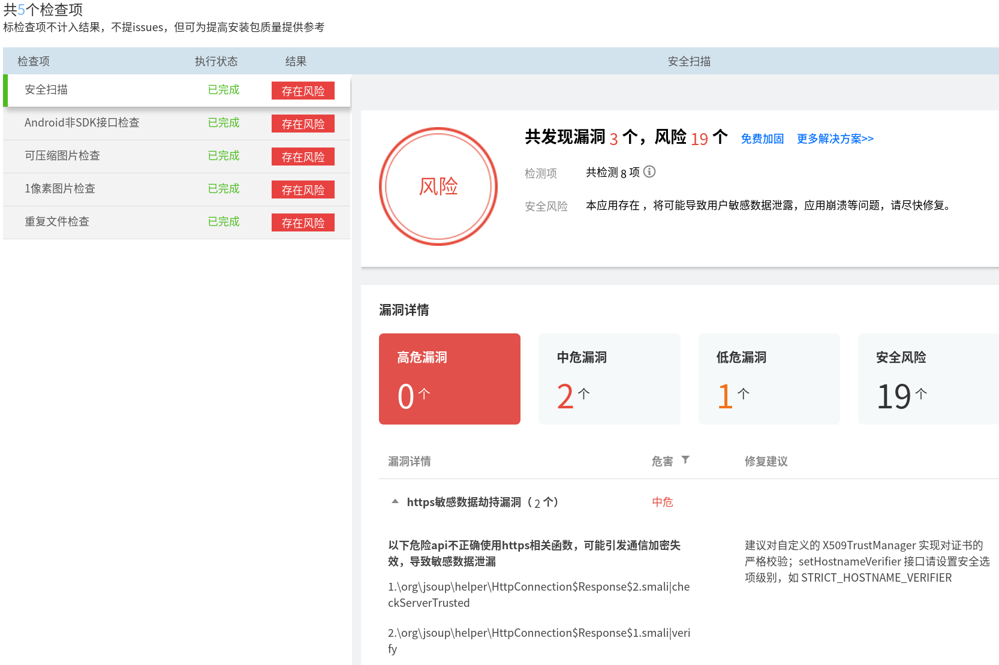

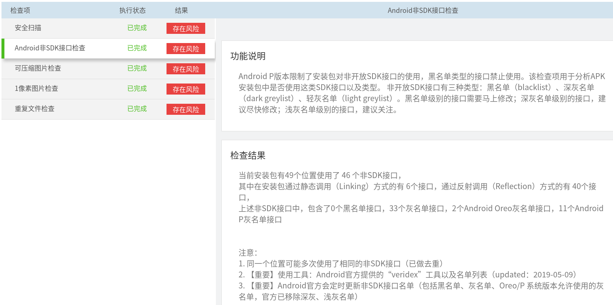

# Other stuff

-   对于移动应用来说，一般来说能够安装而且能够正常运行不报错不崩溃就足够了。但“能正常运行”这件事情其实定义是比较宽泛的。

-   网页的兼容性测试也有一个[好玩的站点](https://www.browserling.com/)，效果大概是这样的：

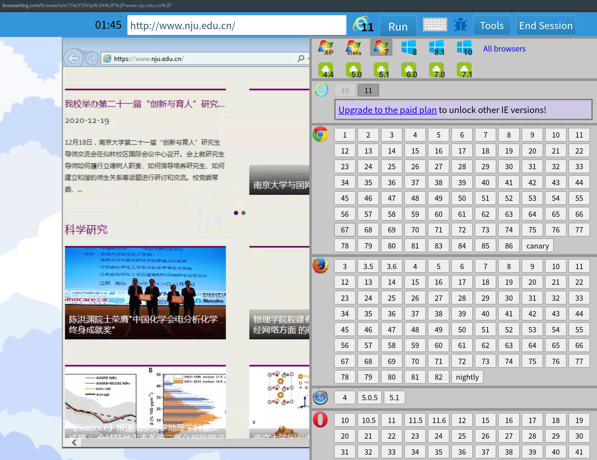

# Research Point & References

-   [这篇论文](https://dl.acm.org/doi/abs/10.1145/1985793.1985870)提到了网页的跨浏览器兼容性测试依然没有系统性的自动化测试方法。

    >   Although the problem is widely recognized among web developers, **no systematic approach** to tackle it exists today. None of the current tools, which **provide screenshots or emulation environments**, specifies any notion of cross-browser compatibility, much less check it **automatically**.

-   尽管前面针对Android APP进行测试时有可用的测试工具，但[测试的效率和可扩展性](https://dl.acm.org/doi/abs/10.1145/1390630.1390640)都有进一步提升的空间。

    >   ​	Because there are complex and changing interdependencies between components and their versions, and because there are such a large number of configurations, it is **generally infeasible to test all potential configuration**s. Consequently, in practice, compatibility testing **examines only a handful of default or popular configurations** to detect problems; as a result **costly errors can and do escape to the field**.

-   关于Automated application compatibility testing，之前实践时所用的方法类似的思想其实早就由Google申请了[US Patent](https://patents.google.com/patent/US8996988B2/en)

-   ...

    

